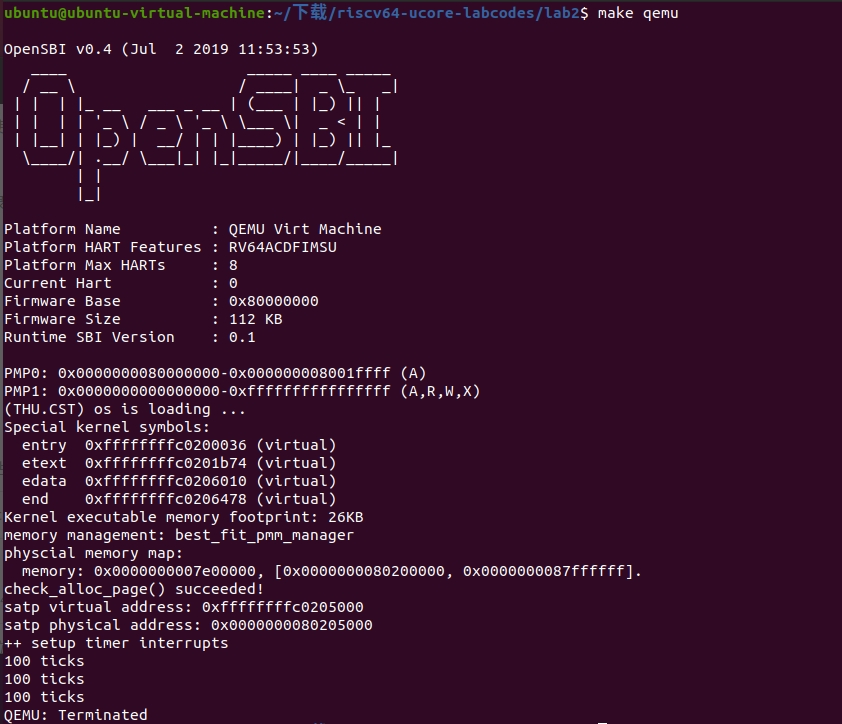
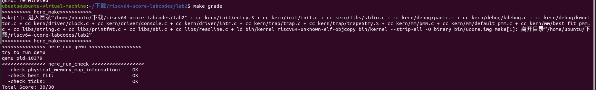

# lab2：物理内存和页表

## 练习1：理解first-fit连续物理内存分配算法

### Q1：相关函数的作用

- `default_init()`

  ```c
  default_init(void) {
      list_init(&free_list);
      nr_free = 0;
  } //初始化free_list，并将nr_free设置为0，free_list 用于记录空闲内存块，nr_free 是空闲内存块的总数
  ```

- `default_init_memmap`

  ```c
  //default_init_memmap用于空闲快的初始化，形成了一个函数调用图，经过路径kern_init -> pmm_init -> page_init -> init_memmap -> pmm_manager->init_memmap.这段代码的主要作用是初始化一组连续的空闲页面，将它们标记为有效的，并将它们按照地址顺序添加到空闲页列表 free_list 中，以供后续的内存分配操作使用
  default_init_memmap(struct Page *base, size_t n) {
      assert(n > 0);
      struct Page *p = base;  // 确保页面已被标记为保留（已分配或不可用）
      for (; p != base + n; p ++) {
          assert(PageReserved(p));
          p->flags = p->property = 0; 
          //如果此页面是空闲的且不是空闲块的第一页，则 p->property 应该设置为 0。
          //如果此页面是空闲的且是空闲块的第一页，则 p->property 应该设置为块的总数
          set_page_ref(p, 0); //设置为0，无引用
      }
      base->property = n; //第一页，设为块数n
      SetPageProperty(base);
      nr_free += n;
      if (list_empty(&free_list)) {
          list_add(&free_list, &(base->page_link));// 如果free_list为空,直接将该空闲块添加到free_list
      } else {
          list_entry_t* le = &free_list;// 从free_list头开始遍历
          while ((le = list_next(le)) != &free_list) {
              struct Page* page = le2page(le, page_link);//获取当前页面
              if (base < page) {
                  list_add_before(le, &(base->page_link));// 如果基地址小于当前页面的地址，将该空闲块插入到当前页面之前，
                  break;
              } else if (list_next(le) == &free_list) {// 如果已经遍历到最后一个页面，// 将该空闲块添加到最后
                  list_add(le, &(base->page_link));
              }
          }
      }
  }
  ```

- `default_alloc_pages`

  ```c
  //实现一个用于从空闲页面链表 free_list 中分配指定数量的空闲页面的函数
  default_alloc_pages(size_t n) {
      assert(n > 0);  // 确保 n 大于 0，否则无效的分配请求
      if (n > nr_free) {
          return NULL;  // 如果需要分配的页面数量大于空闲页面总数，则无法分配，返回 NULL
      }
      struct Page *page = NULL;  // 初始化一个指向分配的页面的指针
      list_entry_t *le = &free_list;  // 从 free_list 的头部开始遍历链表
      while ((le = list_next(le)) != &free_list) {
          // 遍历 free_list 中的每一个页面
          struct Page *p = le2page(le, page_link);
          if (p->property >= n) {
              // 找到第一个拥有足够多页面的空闲块
              page = p;
              break;
          }
      }
      if (page != NULL) {
          list_entry_t* prev = list_prev(&(page->page_link));  // 获取当前页面的前一个页面
          list_del(&(page->page_link));  // 从 free_list 中移除当前页面
          if (page->property > n) {
              // 如果当前页面的空闲页面数量大于所需的页面数量
              struct Page *p = page + n;  // 计算剩余页面的起始位置
              p->property = page->property - n;  // 更新剩余页面的 property 值
              SetPageProperty(p);  // 设置剩余页面的属性
              list_add(prev, &(p->page_link));  // 将剩余页面插入到链表中
          }
          nr_free -= n;  // 减去分配的页面数量，更新空闲页面总数
          ClearPageProperty(page);  // 清除当前页面的属性，表示已被分配
          return page;  // 返回分配的页面
      }
      return NULL;  // 如果没有找到足够多的页面来分配，则返回 NULL
  }
  ```

- `default_free_pages`

  ```c
  //释放一块连续的内存页面，首先对要释放的页面进行一些必要的标记和清除，然后将它们插入到 free_list 中，并尝试与相邻的空闲页面合并，以尽量减少碎片化
  default_free_pages(struct Page *base, size_t n) {
      assert(n > 0);
      struct Page *p = base;
      // 确保 n 大于 0
      assert(n > 0);
  
      // 依次处理要释放的 n 个页面
      for (; p != base + n; p++) {
          // 确保页面既不是保留页面也不是属性页面
          assert(!PageReserved(p) && !PageProperty(p));
  
          // 重置页面的标志位和引用计数
          p->flags = 0;
          set_page_ref(p, 0);
      }
  
      // 设置 base 页面的 property 为 n，并标记为属性页面
      base->property = n;
      SetPageProperty(base);
      // 增加 nr_free（空闲页面数量）的计数
      nr_free += n;
      // 如果 free_list 是空的，将 base 插入到头部
      if (list_empty(&free_list)) {
          list_add(&free_list, &(base->page_link));
      } else {
          // 否则，查找合适的位置插入 base 页面
          list_entry_t* le = &free_list;
          while ((le = list_next(le)) != &free_list) {
              struct Page* page = le2page(le, page_link);
              if (base < page) {
                  list_add_before(le, &(base->page_link));
                  break;
              } else if (list_next(le) == &free_list) {
                  list_add(le, &(base->page_link));
              }
          }
      }
      // 查找前一个页面并尝试与其合并
      list_entry_t* le = list_prev(&(base->page_link));
      if (le != &free_list) {
          p = le2page(le, page_link);
          if (p + p->property == base) {
              // 合并页面
              p->property += base->property;
              ClearPageProperty(base);
              list_del(&(base->page_link));
              base = p;
          }
      }
      // 查找后一个页面并尝试与其合并
      le = list_next(&(base->page_link));
      if (le != &free_list) {
          p = le2page(le, page_link);
          if (base + base->property == p) {
              // 合并页面
              base->property += p->property;
              ClearPageProperty(p);
              list_del(&(p->page_link));
          }
      }
  }
  ```

- `basic_check(void)`和`default_check(void)`共同用于检查上面的`first-fit`算法是否正常分配内存，验证其正确性


### Q2：实现过程

​		`First-Fit` 连续物理内存分配算法主要思想是维护一个空闲块列表（`free list`），并在接收到内存分配请求时，沿着列表查找第一个足够大的空闲块来满足请求。如果找到的空闲块的大小远大于请求的大小，通常会将其分割成两部分，一部分分配给请求，而剩余部分仍然保留在空闲块列表中

​		**下面是物理内存分配相关的重要过程：**

1. **初始化**：在初始化时，首先需要初始化一个空闲块列表（`free list`）和一个变量 `nr_free` 用于跟踪空闲页面的数量
2. **初始化空闲块**：当内核启动时，通过 `default_init_memmap` 函数初始化空闲块。这个函数将一块连续的内存空间分为多个页面，并将这些页面初始化为空闲块。每个页面的属性被设置为有效（`PG_property = 1`），并且它的引用计数被设置为 0。如果页面是空闲块的第一页，它的 `property` 被设置为整个块的大小，否则被设置为 0。这些页面被添加到 `free list` 中，并更新 `nr_free` 变量
3. **分配内存**：当应用程序请求内存分配时，使用 `default_alloc_pages` 函数来分配页面。
   - 首先，它检查请求的页面数量是否大于 0，然后检查是否有足够的空闲页面来满足请求（`n > nr_free`）。如果没有足够的页面，它返回 `NULL`
   - 遍历空闲块列表，寻找**第一个**拥有足够多页面的空闲块（`property >= n`）
   - 如果找到了，分配页面，并将其从空闲块列表中移除
   - 如果该空闲块的大小大于请求的大小，将剩余的页面添加到空闲块列表，更新其属性，并更新 `nr_free` 变量

4. **释放内存**：使用 `default_free_pages` 函数释放页面。
   - 首先，检查释放的页面数量是否大于 0
   - 然后，将页面的属性重置，包括标志位和引用计数
   - 接着，将释放的页面添加到空闲块列表中
   - 然后尝试合并相邻的空闲块，以减少碎片


### Q3：对first-fit算法的改进

​		内存管理的主要问题在于**内存高度碎片化**带来的资源浪费和不合理的**排列方式**带来的**检索时间开销**，针对以上的问题，我们尝试提出以下的方案：

1. **合并碎片内存**：在内存释放的函数中已经实现了释放内存后尝试合并前后空闲内存块的操作，而在分配内存的时候，并没有重新管理经分配后更加碎片的内存块，因此，在`default_alloc_pages()`分割内存块之后，应该尝试将剩下的空闲内存块和后面可能存在的内存块进行合并，加大其被使用的可能性。
2. **将内存块按大小排序**：该算法主要维护一个有序的空闲块列表（从大到小排），帮助快速找到大小合适的块。但这种方法并不能保证提高效率，它在时间和空间上的弊端同样显著：
   - **极高的插入成本，难以适用于动态分配**：这种开销主要来自于内存动态分配时内存块大小发生变化导致的重排，也就是说，在每次分配内存或释放内存后，都可能导致有序列表的重新排列，这种排序算法的时间开销很大
   - **内存开销**：维护有序列表通常需要额外的内存空间来存储
3. **改变空闲块的数据结构**：目前的空闲块列表以无序的队列构成，但平衡二叉树或优先队列等算法能够提高算法插入、查找操作的性能

## 练习2：实现 Best-Fit 连续物理内存分配算法

### Q1：实现过程

​		Best-Fit 连续物理内存分配算法旨在找到最适合需求的空闲内存块以最大程度地减少内存浪费

​		**下面是物理内存分配相关的重要过程**：

1. **初始化**：`best_fit_init`中实现，与First-Fit一致
2. **初始化内存映射**：`best_fit_init_memmap`中实现，与First-Fit一致
3. **分配页面**（`best_fit_alloc_pages`）：
   - 接收所需的连续页块数量 `n` 作为参数
   - 如果请求的连续页块数量大于当前可用的空闲页块数量 `nr_free`，则无法分配，返回 `NULL`
   - 否则，遍历 `free_list` 链表中的空闲页块，查找满足需求的空闲页块
   - **在遍历过程中，记录满足需求且大小最小的空闲页块，并将其分配给请求**
   - 从空闲链表中删除该页块，然后根据需求和空闲页块大小进行分割（如果需要），并更新空闲页块链表以及 `nr_free`
4. **释放页面**（`best_fit_free_pages`）：
   - 接收一个起始页块和页块数量作为参数，表示要释放的一块连续的物理内存
   - 对该连续内存区域中的每个页块进行如下操作：
     - 清空页块的标志和引用计数
     - 设置页块的 `property` 属性为释放的页块数量，并将其标记为属性页块
     - 将这些页块插入到 `free_list` 中的适当位置，以保持空闲页块链表的顺序
   - 尝试合并前后相邻的空闲页块，以减少碎片化

### Q2：代码实现

- `best_fit_init_memmap()`

  ```c
  best_fit_init_memmap(struct Page *base, size_t n) { //与default_init_memmap()相反，改为升序
       ………………………………
  	/*LAB2 EXERCISE 2: YOUR CODE*/ 
          // 清空当前页框的标志和属性信息，并将页框的引用计数设置为0
          p->flags = p->property = 0;
          set_page_ref(p, 0);
       ………………………………
       /*LAB2 EXERCISE 2: YOUR CODE*/ 
              // 编写代码
              // 1、当base < page时，找到第一个大于base的页，将base插入到它前面，并退出循环
              // 2、当list_next(le) == &free_list时，若已经到达链表结尾，将base插入到链表尾部
              if (base < page)
              {
                  list_add_before(le, &(base->page_link));
                  break;
              }
              else if(list_next(le) == &free_list)
              {
                  list_add(le, &(p->page_link));
              }
       ………………………………
  }
  ```

- `best_fit_alloc_pages()`

  ```c
  best_fit_alloc_pages(size_t n) {
       ………………………………
      /*LAB2 EXERCISE 2: YOUR CODE*/ 
      // 下面的代码是first-fit的部分代码，请修改下面的代码改为best-fit
      // 遍历空闲链表，查找满足需求的空闲页框
      // 如果找到满足需求的页面，记录该页面以及当前找到的最小连续空闲页框数量
      while ((le = list_next(le)) !=  &free_list) {
          struct Page *p = le2page(le, page_link);
          if (p->property >= n && p->property < min_size) {
              min_size = p->property;
              page = p;
  
          }
      }
      ………………………………
  }
  ```

- `best_fit_free_pages()`

  ```c
  best_fit_free_pages(struct Page *base, size_t n) {  //default_free_pages()一致
      ………………………………
      /*LAB2 EXERCISE 2: YOUR CODE*/ 
      // 编写代码
      // 具体来说就是设置当前页块的属性为释放的页块数、并将当前页块标记为已分配状态、最后增加nr_free的值
      base->property=n;
      SetPageProperty(base);
      nr_free+=n;
      ………………………………
      list_entry_t* le = list_prev(&(base->page_link));
      if (le != &free_list) {
          /*LAB2 EXERCISE 2: YOUR CODE*/ 
           // 编写代码
          // 1、判断前面的空闲页块是否与当前页块是连续的，如果是连续的，则将当前页块合并到前面的空闲页块中
          // 2、首先更新前一个空闲页块的大小，加上当前页块的大小
          //#define PHYSICAL_MEMORY_OFFSET      0xFFFFFFFF40000000 3、清除当前页块的属性标记，表示不再是空闲页块
          // 4、从链表中删除当前页块
          // 5、将指针指向前一个空闲页块，以便继续检查合并后的连续空闲页块
          p = le2page(le, page_link);
          if (p + p->property == base)
          {
              p->property += base->property;
              ClearPageProperty(base);
              list_del(&(base->page_link));
              base=p;
          }
      }
      
  }
  ```

### 运行结果截图





### Q3：对best-fit算法的改进

​		best-fit由于选择最小的可以配内存块进行分割，容易产生极小的空闲块，在后续分配中被使用的可能性很低，造成了**过度的碎片化和资源浪费**，并且，由于best-fit采取的是遍历的方式，访问过程造成了巨大的**时间开销**，这都成为影响best-fit算法的重要因素，针对以上的问题，我们尝试提出以下的方案：

1. **使用索引结构**：使用二叉搜索树或者跳表等结构，可能能减少搜索时间，类似二分的思想，但是这种数据结构的管理相对复杂，并且需要动态维护，此时构建索引结构的开销会影响这种改进的效果
2. **合并碎片内存**：与first-fit的算法一样，我们没有实现在分配内存时对空闲内存块的合并管理，因此，将空闲的小内存块及时与相邻的空闲内存块合并能提高内存块的使用率
3. **分级管理**：将空闲页块按照大小分成不同的级别，每个级别包含一组相似大小的页块。在分配时，首先选择最接近需求大小的级别，然后在该级别中进行查找。这可以减小查找的范围，提高查找效率

## 关于链表升序和降序的选择思考

1. **First-Fit**：在 First-Fit 策略中，分配算法会尽早地选择满足需求的第一个空闲块，即遍历空闲块链表，找到第一个足够大的块并将其分配。这意味着它会选择第一个合适的块，即使该块不是最佳的选择。因此，在插入空闲块时，如果基地址小于当前页面的地址，它会将该空闲块插入到当前页面之前，**以便更快地找到并分配**
2. **Best-Fit**：与 First-Fit 不同，Best-Fit 策略要选择最小且足够大的空闲块来分配。因此，在查找过程中，它需要遍历整个空闲块链表，以找到大小最接近需求的块。这意味着 Best-Fit 不会立即选择第一个合适的块，而是寻找最佳的块。因此，在插入空闲块时，如果基地址小于当前页面的地址，Best-Fit 会将该空闲块插入到当前页面之后，**以便更好地利用较小的碎片**

## 重要知识点
### 1. sv39页表机制
每个页的大小是 **4KB** ，也就是4096个字节。在 sv39中，定义 **物理地址(Physical Address)有 56位** ，而  **虚拟地址(Virtual Address) 有 39位** 。实际使用的时候，一个虚拟地址要占用 64位，只有低 39位有效，我们规定 63−39 位的值必须等于第 38 位的值。 不论是物理地址还是虚拟地址，我们都可以认为， **最后12位表示的是页内偏移**，也就是这个地址在它所在页帧的什么位置。除了最后12位，前面的部分表示的是物理页号或者虚拟页号。

    **boot_page_table_sv39[]** 是一个数组，它用于存储 RISC-V 架构中的 Sv39 地址转换表（Page Table）。在 RISC-V 架构中，用于管理虚拟地址和物理地址之间的转换关系的是页表。Sv39 是一种页表格式，它将虚拟地址划分为三个层级：页全局目录（Page Global Directory），页中间目录（Page Mid-Level Directory）和页表（Page Table）

    我们使用的sv39权衡各方面效率，使用 **三级页表**。有 **4KiB=4096字节的页** ，**大小为2MB= 2^21 字节的大页** ，和 **大小为1 GB 的大大页**。

### 2. satp寄存器
satp里面存是 **最高级页表的物理页号**。除了物理页号，satp还包含其他信息。


MODE：表示地址翻译模式，占据 1 个比特位。RISC-V 支持不同的地址翻译模式，如 RV32、RV64 和 RV128，其中 MODE 指定当前系统所采用的模式。
- 0000表示不使用页表，直接使用物理地址，在简单的嵌入式系统里用着很方便。
- 1000表示sv39页表，也就是我们使用的，虚拟内存空间高达512GiB。
- 1001表示Sv48页表，它和Sv39兼容。
- 其他编码保留备用 ASID（address space identifier）我们目前用不到 OS 可以在内存中为不同的应用分别建立不同虚实映射的页表，并通过修改寄存器 satp 的值指向不同的页表，从而可以修改 CPU 虚实地址映射关系及内存保护的行为。

ASID：地址空间标识符，占据 9 个比特位。ASID 用于区分不同的地址空间，允许不同的上下文使用相同的虚拟地址。

PPN：物理页号（Physical Page Number），占据 22 个比特位。PPN 存储的是 satp 所指示的页表的物理地址，用于进行虚拟地址到物理地址的转换。

### 3. 页表项


- RSW：两位留给 S Mode 的应用程序，我们可以用来进行拓展。
- D：即 Dirty ，如果 D=1 表示自从上次 D 被清零后，有虚拟地址通过这个页表项进行写入。
- A，即 Accessed，如果 A=1 表示自从上次 A 被清零后，有虚拟地址通过这个页表项进行读、或者写、或者取指。
- G，即 Global，如果 G=1 表示这个页表项是“全局”的，也就是 **所有的地址空间（所有的页表）都包含这一项**
- U，即 user，U为 1 表示用户态 (U Mode)的程序 可以通过该页表项进映射。 **在用户态运行时也只能够通过 U=1 的页表项进行虚实地址映射** 。
注意，S Mode 不一定可以通过 U=1 的页表项进行映射。我们需要将 S Mode 的状态寄存器 sstatus 上的 SUM 位手动设置为 1 才可以做到这一点（通常情况不会把它置1）。否则通过 U=1 的页表项进行映射也会报出异常。另外， **不论sstatus的SUM位如何取值，S Mode都不允许执行 U=1 的页面里包含的指令，这是出于安全的考虑。**

R,W,X 为许可位，分别表示是否可读 (Readable)，可写 (Writable)，可执行 (Executable)。


### 4. 快表的刷新
- 修改了satp 寄存器（比如PPN字段）说明我们切换到了一个与先前映射方式完全不同的页表。此时快表里面存储的映射结果就跟不上时代了，很可能是错误的。
- 手动修改一个页表项之后，也修改了映射，但 TLB 并不会自动刷新

这两种情况下我们要 **使用sfence.vma 指令刷新整个 TLB** 。如果不加参数的， sfence.vma 会刷新整个 TLB 。你可以在后面加上一个虚拟地址，这样 sfence.vma 只会刷新这个虚拟地址的映射。
 
### 5. 进入虚拟内存访问方式

思路：构建一个合适的页表，让satp指向这个页表，然后使用地址的时候都要经过这个页表的翻译，使得虚拟地址0xFFFFFFFFC0200000经过页表的翻译恰好变成0x80200000。

**将一个三级页表项的标志位 R,W,X 不设为全 0 ，可以将它变为一个叶子，从而获得大小为 1GB 的一个大页。**

kern_entry:
- 获取三级页表的页号（虚拟地址的前20位）VA
- 计算虚实映射偏移量w
- 三级页表所在的物理地址PA=VA-w
- 三界页表所在的物理页号：PA的前20位
- 将算出的(即新的MODE|页表基址物理页号) 覆盖到 satp 中
- 使用 sfence.vma 指令刷新 TLB

### 6. 物理内存管理

（1）函数调用流程
```
kern_entry()——>kern_init()——>idt_init()
                            ——>pmm_init()——>init_pmm_manager()
                                        ——> page_init()
                                        ——>check_alloc_page()
                            ——>idt_init()//执行中断和异常相关的初始化工作
                            ——>clock_init()
                            ——>init clock interrupt
                            ——>intr_enable();  //允许硬件中断
```

（2）相关结构体和函数的定义

1) pmm_manager类【kernel/mm/pmm.h】
```
- pmm_manager的名字
- init_memmpap函数
    参数：页面指针base,分页数n
    作用：初始化页表

- alloc_pages函数
    参数：分页数n
    作用：分配一定数量页面，返回页面指针

- free_pages函数
    参数：页面指针base,分页数n
    作用：释放一定数量的页的内存

- nr_free_pages函数
    作用：返回释放的页数

- check函数
    作用：于检测分配/释放实现是否正确
```

2) pmm_init()函数。【kernel/mm/pmm.c】
```
-1.初始化结构体pmm_manager;选择可用策略为最佳适配（best_fit）
init_pmm_manager();

-2.检测物理内存空间，保留已经使用的内存，然后使用pmm->init_memmap函数创建空闲页列表。这样就可以分配以页（4KB）为单位的空闲内存了
page_init();

-3.检查pmm中的alloc/free 函数的正确性
check_alloc_page();

-4.输出包含页表信息的数组的虚拟地址、物理地址
```

3) init_pmm_manager()函数【kernel/mm/pmm.c】
作用见上面注释
4) page_init()函数【kernel/mm/pmm.c】
```
-虚拟地址和物理地址之间的偏移量。
    va_pa_offset = PHYSICAL_MEMORY_OFFSET;

-描述物理内存的范围
    uint64_t mem_begin = KERNEL_BEGIN_PADDR;
    uint64_t mem_size = PHYSICAL_MEMORY_END - KERNEL_BEGIN_PADDR;
    uint64_t mem_end = PHYSICAL_MEMORY_END; //硬编码取代 sbi_query_memory()接口
-输出物理内存映射的信息（mem_size, mem_begin,mem_end - 1）

-maxpa表示最大物理地址的变量

-分页个数npage = maxpa / PGSIZE;

-bootloader加载ucore的结束地址end,它以上的空间没有被使用。将end地址进行舍入操作，舍入为最接近的大于等于PGSIZE倍数的地址，并将这个对齐后的地址强制转换为struct Page类型的指针。这样，pages指针就指向了对齐后的地址，可以用于后续操作。
    pages = (struct Page *)ROUNDUP((void *)end, PGSIZE);
    
-可用内存页个数= 动态随机存取存储器（DRAM）的起始地址/页面大小
    nbase=DRAM_BASE/PGSIZE

-从0到npage - nbase的范围，对前面的页进行标记为SetPageReserved

    //计算剩余空闲页的起始物理地址freemem，将其舍入到最接近的大于等于PGSIZE倍数的地址。
    uintptr_t freemem = PADDR((uintptr_t)pages + sizeof(struct Page) * (npage - nbase));

    mem_begin = ROUNDUP(freemem, PGSIZE);
    mem_end = ROUNDDOWN(mem_end, PGSIZE);

    //根据计算得到的起始物理地址和内存结束地址进行内存映射初始化，使用init_memmap函数进行操作。
    if (freemem < mem_end) {
        init_memmap(pa2page(mem_begin), (mem_end - mem_begin) / PGSIZE);
    }
```
7.双链表【libs/defs.h】
```c
//1.函数offsetof的参数为type、member，取出指针0指向对象的成员变量member,返回member的地址。
#define offsetof(type, member)                                      \
    ((size_t)(&((type *)0)->member))

/* *
 * to_struct - get the struct from a ptr
 * @ptr:    a struct pointer of member
 * @type:   the type of the struct this is embedded in
 * @member: the name of the member within the struct
 * */
 //2.函数to_struct的参数为ptr、type、member
#define to_struct(ptr, type, member)                               \
    ((type *)((char *)(ptr) - offsetof(type, member)))

```
1.offsetof函数：返回双链块的位置与块中prev指针位置的偏移

2.to_struct函数：将prev指针转化为链表块指针

上述两个函数的原理如下图：


8.Page管理物理页
```c
【memlayout.h】
struct Page {
    int ref;                        // 对应的虚拟页个数（被页表的引用记数
）
    uint64_t flags;                 // flags数组，描述页框的状态 
    unsigned int property;          //（首次适应策略下）的空闲页个数
    list_entry_t page_link;         //双向空闲链表
};
```
- property表示连续空闲页的个数。在不同策略下，地址（或容量）最低（或最高）的Head Page会用到它。
- flags有两个比特位，第一个比特位表示是否reserved，第二个比特位表示是否被分配掉。是的情况下，比特位置1，这两种情况都不能放到空闲页链表中。

### 探测系统物理内存布局
1. PADDR()：VA转化为PA
```c
#define PADDR(kva)                                                 \
    ({                                                             \
        uintptr_t __m_kva = (uintptr_t)(kva);                      \
        if (__m_kva < KERNBASE) {                                  \
            panic("PADDR called with invalid kva %08lx", __m_kva); \
        }                                                          \
        __m_kva - va_pa_offset;                                    \
    })
    //KERNBASE=0x80200000(物理内存里内核的起始位置)
```


    

