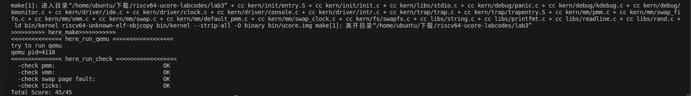
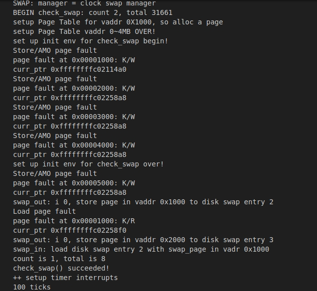
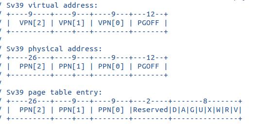

### 练习1：理解基于FIFO的页面替换算法

在下列呈现中为了体现逻辑关系，采取了嵌套方式，在此罗列出所有函数

```c
1.swap_init(void);
2.swapfs_init(void);
3._fifo_init(void);
4._fifo_init_mm(struct mm_struct *mm);
5._fifo_map_swappable(struct mm_struct *mm, uintptr_t addr, struct Page *page, int swap_in);
6.swap_out();
7._fifo_swap_out_victim(struct mm_struct *mm, struct Page ** ptr_page, int in_tick);
8.swapfs_write(swap_entry_t entry, struct Page *page);
9.tlb_invalidate(pde_t *pgdir, uintptr_t la);
10.swap_in(struct mm_struct *mm, uintptr_t addr, struct Page **ptr_result);
11.swapfs_read(swap_entry_t entry, struct Page *page);
12.*get_pte(pde_t *pgdir, uintptr_t la, bool create);
```

1. `swap_init(void):`初始化swap，选择算法

   - `swapfs_init();`初始化交换文件系统

     - ```c
       //kern/fs/swapfs.c
       swapfs_init(void) {
           static_assert((PGSIZE % SECTSIZE) == 0); //静态断言，判断页大小是否能被扇区大小整除
           if (!ide_device_valid(SWAP_DEV_NO)) { //检查交换设备是否有效
               panic("swap fs isn't available.\n");
           }
           max_swap_offset = ide_device_size(SWAP_DEV_NO) / (PGSIZE / SECTSIZE); //计算最大偏移量
       }
       ```

   - `sm = &swap_manager_fifo;`选择目的算法

   - `int r = sm->init();`初始化FIFO的内部数据`.init`，主要是判断这个算法是否存在，并被调用

2. `mm_create()->swap_init_mm()->init_mm()=&fifo_init_mm()`初始化FIFO算法的mm结构

   ```c
   static int _fifo_init_mm(struct mm_struct *mm)
   {     
        list_init(&pra_list_head);//初始化一个链表，pra_list_head 是链表头
        mm->sm_priv = &pra_list_head; //mm 结构的 sm_priv 字段设置为&pra_list_head，sm_priv 是内存管理结构 mm 的私有字段，用于存储与特定页面置换算法相关的信息
        return 0;
   }
   ```

3. `swap_map_swappable()->map_swappable()=&fifo_map_swappable` 将最近可达的页面放入FIFO队列，表示被访问过

   ```c
   static int _fifo_map_swappable(struct mm_struct *mm, uintptr_t addr, struct Page *page, int swap_in)
   {
       list_entry_t *head=(list_entry_t*) mm->sm_priv;// 获取链表头指针
       list_entry_t *entry=&(page->pra_page_link);//获取要添加的节点
    
       assert(entry != NULL && head != NULL); //断言，entry和head不为空，避免错误
       //record the page access situlation
       list_add(head, entry);//将最近可达的页面放到链表的末尾
       return 0;
   }
   ```

4. `swap_out()`

   - `swap_out_victim()= &_fifo_swap_out_victim`找到FIFO队列最早被访问的页面，从队列中移除，置换出去

   ```c
   static int _fifo_swap_out_victim(struct mm_struct *mm, struct Page ** ptr_page, int in_tick)
   {
        list_entry_t *head=(list_entry_t*) mm->sm_priv;
            assert(head != NULL);
        assert(in_tick==0);
   
       list_entry_t* entry = list_prev(head);//从队列头（head）取出链表中最早到达的页面（即最早进入队列的页面）的链表项 entry
       if (entry != head) {
           list_del(entry);
           *ptr_page = le2page(entry, pra_page_link);
       } else {
           *ptr_page = NULL; //如果链表为空（即 entry == head），表示没有可以被置换的页面，因此将 *ptr_page 设置为 NULL
       }
       return 0;
   }
   ```

   - `swapfs_write()`将页面数据写入磁盘交换文件
   - `tlb_invalidate()`使TLB失效，确保页表项被更新

5. `swap_in()`将页面数据从磁盘读取到内存中

   - `alloc_page`分配空闲物理页
   - `get_pte()`获取`addr`对应的页表项
   - `swapfs_read()`从磁盘交换文件中读取数据存储到物理页中

### 练习2：深入理解不同分页模式的工作原理

### 练习3：给未被映射的地址映射上物理页

1. 代码（`do_pgfault（mm/vmm.c）`）

   ```c
   int do_pgfault(struct mm_struct *mm, uint_t error_code, uintptr_t addr) {
      …………
       } else {
           /*LAB3 EXERCISE 3: YOUR CODE*/
           if (swap_init_ok) {
               struct Page *page = NULL;
              
               if(swap_in(mm,addr,&page)!=0)//将磁盘上的页面内容加载到内存中，存储在page里，若返回值不为0，意味着换入失败
               {
                   cprintf("swap_in in do_pgfault failed\n");
                   goto failed;
               }
               page_insert(mm->pgdir,page,addr,perm);//将刚刚加载的物理页 page 插入到当前进程的页表 pgdir 中，与虚拟地址 addr 建立映射关系
               swap_map_swappable(mm,addr,page,1);//将页面标记为可交换
               page->pra_vaddr = addr;//将页面结构 page 中的 pra_vaddr 字段设置为虚拟地址 addr，以表示这个页面是由访问异常加载的
           } else {
               cprintf("no swap_init_ok but ptep is %x, failed\n", *ptep);
               goto failed;
           }
      }
     …………
   }	
   ```

2. 请描述页目录项（Page Directory Entry）和页表项（Page Table Entry）中组成部分对ucore实现页替换算法的潜在用处

   - **PDE：**PDE为ucore管理和维护内存提供了结构上的支持
     - **多级页表管理：**利用多级页表机制，使得4GB的地址空间映射到物理内存上，多级列表帮助ucore管理更大的内存空间
     - **内存隔离：**通过设置PDE，ucore为不同的进程分配不同的页表，也就实现了不同进程数据彼此独立
   - **PTE：**
     - **存在位（Present Bit）**：存在位表示一个虚拟页是否当前存在于物理内存中。在页替换算法中，如果某个虚拟页需要被替换出去，可以通过将存在位设置为0来表示该虚拟页不再存在于内存中。
     - **访问位（Accessed Bit）**：访问位用于记录虚拟页的访问情况。在一些页替换算法中，如Clock算法，访问位用于判断虚拟页的访问情况，有助于识别哪些页面被频繁访问，哪些可以被替换出去。
     - **修改位（Dirty Bit）**：修改位表示虚拟页的内容是否被修改过。在页替换算法中，如果虚拟页被修改过，需要将其写回磁盘或交换空间，以确保数据的一致性。修改位可以帮助算法决定哪些页面需要写回。
     - **页面帧号（Page Frame Number）**：页面帧号字段指示虚拟页对应的物理页框号。在页替换算法中，需要根据这个字段确定哪个物理页被替换出去，以便将新的虚拟页加载到相同的物理页框。
     - **权限位（Protection Bits）**：权限位用于指定虚拟页的读写权限。在某些页替换算法中，需要检查虚拟页的权限，以决定是否可以替换出去。如果虚拟页是只读的，通常不会被替换出去。

3. 如果ucore的缺页服务例程在执行过程中访问内存，出现了页访问异常，请问硬件要做哪些事情？

   - **触发异常**：当程序访问一个虚拟内存地址，而相应的页表项标志位（Present Bit）表示该虚拟页不在物理内存中（存在位为0）时，硬件会触发页访问异常。
   - **保存上下文**：硬件会自动保存当前进程的上下文，包括程序计数器（PC）和其他寄存器的值。
   - **转入异常处理程序**：硬件将控制权传递给操作系统内核的缺页异常处理程序。
   - **处理缺页异常**：缺页异常处理程序会根据虚拟地址和当前进程的页表等信息，确定页面调度策略，选择一个物理页来替换或加载进程所需的虚拟页。
   - **更新页表**：在处理缺页时，操作系统会更新页表，将虚拟页映射到新的物理页框中，以满足进程对虚拟内存的访问需求。
   - **回复上下文**：处理完缺页异常后，硬件会恢复之前保存的进程上下文，继续执行导致缺页异常的指令。

4. 数据结构Page的全局变量（其实是一个数组）的每一项与页表中的页目录项和页表项有无对应关系？如果有，其对应关系是啥？

   - Page数据结构通常表示物理页框，每个Page结构对应一个物理页。
   - 页表中的页目录项（Page Directory Entry）和页表项（Page Table Entry）包含了关于虚拟页与物理页的映射信息。
   - 通过这些映射信息，操作系统可以找到虚拟页对应的物理页框，将虚拟地址转化为物理地址，或者反之。


### 练习4：补充完成Clock页替换算法

1. 代码（`mm/swap_clock.c`）

   - `_clock_init_mm(struct mm_struct *mm)`

     ``` c
     _clock_init_mm(struct mm_struct *mm)
     {           
         /*LAB3 EXERCISE 4: YOUR CODE*/ 
          list_init(&pra_list_head);     // 初始化pra_list_head为空链表
          curr_ptr=mm->sm_priv=&pra_list_head;     
         // 初始化当前指针curr_ptr指向pra_list_head，表示当前页面替换位置为链表头
         // 将mm的私有成员指针指向pra_list_head，用于后续的页面替换算法操作
          return 0;
     }
     ```

   - `_clock_map_swappable(struct mm_struct *mm, uintptr_t addr, struct Page *page, int swap_in)`

     ```c
     _clock_map_swappable(struct mm_struct *mm, uintptr_t addr, struct Page *page, int swap_in)
     {
         list_entry_t *entry=&(page->pra_page_link);
         assert(entry != NULL && curr_ptr != NULL);
           /*LAB3 EXERCISE 4: YOUR CODE*/ 
         list_add(&pra_list_head,entry);    // 将页面page插入到页面链表pra_list_head的末尾
         curr_ptr=list_prev(&pra_list_head);//更新当前页面指针 curr_ptr，指向链表中上一个页面
         page->visited=1;    // 将页面的visited标志置为1，表示该页面已被访问
         
         return 0;
     }
     ```

   - `_clock_swap_out_victim(struct mm_struct *mm, struct Page ** ptr_page, int in_tick)`

     ```c
     _clock_swap_out_victim(struct mm_struct *mm, struct Page ** ptr_page, int in_tick)
     {
          list_entry_t *head=(list_entry_t*) mm->sm_priv;
          assert(head != NULL);
          assert(in_tick==0);
          while (1) {
             /*LAB3 EXERCISE 4: YOUR CODE*/ 
             list_entry_t *le=curr_ptr;
             curr_ptr=list_next(curr_ptr);
             if(curr_ptr==head)
             {
                 curr_ptr=list_next(head);
             }//遍历页面链表pra_list_head
             struct Page *page=le2page(le,pra_page_link); // 获取当前页面对应的Page结构指针
             if(page->visited==0)
             {
                 page->visited=1;
                 list_del(&(page->pra_page_link));
                 *ptr_page=page;
                 return 0;
             }   // 如果当前页面未被访问，则将该页面从页面链表中删除，并将该页面指针赋值给ptr_page作为换出页面
             else{
                 page->visited=0;
             }// 如果当前页面已被访问，则将visited标志置为0，表示该页面已被重新访问
         }
         return 0;
     }
     ```

   - `vmm.c/do_pgfault`

     ```c
     extern list_entry_t *curr_ptr;
     cprintf("curr_ptr %p\n", (void*)curr_ptr);//指定格式输出
     ```

2. 设计实现过程

   1. 在`_clock_init_mm`中初始化要使用的空列表，并将当前指针和私有成员指针都指向这个列表头（列表）

   2. 在`_clock_map_swappable`中将页面插入到列表的末尾，并将其设置为已访问，并且更新`curr_ptr`使其指向链表的上一个页面

   3. 在`_clock_swap_out_victim`中循环遍历整个列表，找到未被访问的页面，执行换出操作，如果重新访问，则`visited`置0，循环直到找到符合要求的页面

      

      

3. 比较Clock页替换算法和FIFO算法的不同

   1. **替换策略**：
      - **FIFO算法**：FIFO算法采用最简单的替换策略，即选择最早进入内存的页面进行替换。这是一个非常直观的策略，但它可能导致"Belady's Anomaly"，即在内存容量不足时，增加页面数并不总是减少缺页中断次数。
      - **Clock页替换算法**：Clock算法是一种改进型的FIFO算法，它引入了页面访问位的概念。它不仅考虑了页面的进入时间，还考虑了页面的访问情况。它在选择页面替换时，会检查页面的访问位，如果访问位为0，表示页面很可能未被访问，将其替换出去；如果访问位为1，表示页面被访问过，将其访问位重置为0，然后继续查找下一页。这可以更好地反映页面的使用情况，减少"Belady's Anomaly"的影响。
   2. **数据结构**：
      - **FIFO算法**：FIFO算法通常使用队列数据结构，最早进入内存的页面在队列头部，最后进入内存的页面在队列尾部。
      - **Clock页替换算法**：Clock算法使用页面链表，页面链表按照页面进入内存的顺序排列，并且通过访问位来进行调整。
   3. **实现**：
      - **FIFO算法**：FIFO算法实现非常简单，只需要维护一个队列，并在需要替换页面时，将队列头部的页面替换出去。
      - **Clock页替换算法**：Clock算法的实现相对复杂一些，需要考虑页面的访问位，以及如何在页面链表中找到合适的替换页面。它通常需要两次遍历页面链表：第一次查找未被访问的页面，第二次进行替换。需要额外的数据结构来表示页面的访问位。
   4. **性能**：
      - **FIFO算法**：FIFO算法的性能相对较差，容易受"Belady's Anomaly"的影响，可能导致缺页中断次数剧烈增加。
      - **Clock页替换算法**：Clock算法相对于FIFO算法来说，性能更好，因为它考虑了页面的访问情况，更有可能保留常被访问的页面，减少缺页中断次数。

### 练习5：阅读代码和实现手册，理解页表映射方式相关知识
如果我们采用“一个大页”的页表映射方式，相比分级页表，有什么好处、优势，有什么坏处、风险？

1. 好处：
- 减少页表的内存占用。“大页”与多级页表相比，减少了页表数量，也就减少了内存占用。
- 减少访问内存的次数。要想访问物理内存数据，n级页表至少需要访问n+1次内存，而“大页”只需要访问2次内存。

2.坏处：
- 只有一个页目录来存储页面的映射关系，当虚拟地址空间很大时，一页的大小也会非常大。为了存储它，需要一个较大的连续物理空间，会导致内存碎片化问题，使得一些小的或不连续的内存空间无法被充分利用。

- 查找速度慢。对于所有的虚拟地址，每次都需要查找整个页表，可能导致访问速度慢。
### 重要知识点
#### 页表项设计
RISC-V采用三级页表。页面大小4KB,页目录和页表中都包含512条页表项。

RISC-V中虚拟地址有39位，物理地址有56位。页表项54位。它们的结构如下图：

#### 多级页表实现虚拟存储

有三个重要的函数：
```
get_pte()，寻找一个页表项

page_remove_pte()，删除页表项中的页表项

page_insert()，在页表里建立一个映射

page_remove()，在页表里删除一个映射
```
get_pte()首先通过pde_t *pdep1 = &pgdir[PDX1(la)];找到对应的一级页表项，然后通过类似的方法，用一级页表项去查二级页表项，用二级页表项查三级页表。如果没有找到三级页表项，返回null,否则返回三级页表项的指针。 

page_remove_pte()首先检查页表项ptep是否有效（PTE_v标志位是否被设置）然后通过 pte2page(*ptep)找到与pte对应的页面，减少该物理页的引用计数。当物理页面引用计数达到0时释放该页面。最后清除这个页表项 。用tlb_invalidate(pgdir, la)来刷新 tlb。

page_insert()首先调用get_pte获取线性地址la对应的页表项，若这个页表项不存在，返回错误码。若存在，说明该线性地址已经映射了一个物理页。用pte2page()获取该线性地址对应的物理页，如果是同一个物理页，就什么都不做，如果不是同一个物理页，page_remove_pte函数将该页表项删除，建立一个新的页表项。

page_remove()首先用 get_pte获取线性地址la对应的页表项，若这个页表项存在，就调用 page_remove_pte()来删除它。

#### 页表替换算法思想

**1.先进先出(FIFO)：** 该算法总是淘汰最先进入内存的页。

实现：把一个应用程序在执行过程中已调入内存的页按先后次序链接成一个队列。从队列头查找到需要淘汰的页，将新增的页连接在队尾。</br>
问题：（1）因为那些常被访问的页，往往在内存中也停留得最久，结果它们因变“老”而不得不被置换出去（2）Belady异常，即在增加放置页的物理页帧的情况下，反而使页访问异常次数增多。

**2.最久未使用(LRU)：** 利用局部性，比较当前内存里的页面最近一次被访问的时间，把上一次访问时间离现在最久的页面置换出去。</br>
问题：因为实际情况的不可预测性，这种算法不可能实现。

**3.时钟（Clock）**：它是 LRU 算法的一种近似实现。找出最老且调用次数最少的页面进行替换。

实现：时钟页替换算法把各个页面组织成环形链表的形式，把当前指针指向最老的那个页面，即最先进来的那个页面。当操作系统需要淘汰页时，对当前指针指向的页所对应的页表项进行查询，如果访问位为“0”，则淘汰该页。（ps:如果该页被写过，则还要把它换出到硬盘上）如果访问位为“1”，则将该页表项的访问位置“0”。继续访问下一个页。因此至多查找2圈，就能够找到要淘汰的页面</br>
问题：没有考虑页面是否被修改，若被修改，还要将页面写入到内存中，所以应当优先替换没有被修改的页面。

**4.改进的时钟（Enhanced Clock**不仅考虑了页面是否被访问过，还考虑了被淘汰的页面是否被修改过。因为淘汰修改过的页面还需要写回硬盘，使得其置换代价大于未修改过的页面，所以优先淘汰没有修改的页，减少磁盘操作次数。

实现：当该页被访问时，把访问位置“1”。当该页被“写”时，把修改位置“1”。时钟页替换算法把各个页面组织成环形链表的形式，把当前指针指向最老的那个页面，即最先进来的那个页面。首先查找(访问位，修改位)为(0,0)的页面，不更改访问位或修改位。如果一圈下来没找到，第二圈找(0,1)，遇到访问为“1”的页面，将访问位置“0”。如果第二圈还没找到，第三圈找(0,0),不更改访问位或修改位。如果第三圈还没找到，第四圈找(0,1),一定能找到该页面。因此至多查找4圈，就能够找到要淘汰的页面</br>
问题：为了查找到一个尽可能适合淘汰的页面，可能需要经过多次扫描，增加了算法本身的执行开销。

#### 缺页异常</br>
缺页异常是指 CPU 访问的虚拟地址时，MMU 没有办法找到对应的物理地址映射关系，或者与该物理页的访问权不一致而发生的异常。</br>
在操作系统的设计中，并非所有的物理页都可以换出，只有映射到用户空间且被用户程序直接访问的页面才能被交换，而被内核直接使用的内核空间的页面不能被换出。虚拟内存的空间可以远远大于物理内存，如果程序访问了“不对应物理内存页帧的虚拟内存地址”，CPU应当抛出Page Fault异常。</br>
处理Page Fault异常时，需要设置接口来负责对管理虚拟内存的数据结构释放的内存进行动态分配。接下来处理多级页表，实现页面置换机制。