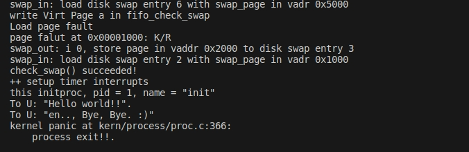

# 练习1：分配并初始化一个进程块（需要编码）
```c
alloc_proc(void) {
    struct proc_struct *proc = kmalloc(sizeof(struct proc_struct));
    if (proc != NULL) {
        proc->state = PROC_UNINIT; //未初始化
        proc->pid = -1; //未分配PID
        proc->runs = 0; //进程的运行次数，未开始运行
        proc->kstack = 0; //进程的内核栈地址
        proc->need_resched = 0; //是否需要重新调度，0表示不需要
        proc->parent = NULL; //父进程
        proc->mm = NULL; //进程内存管理结构，未分配地址空间
        memset(&(proc->context), 0, sizeof(struct context)); //进程上下文
        proc->tf = NULL;//指向中断帧的指针
        proc->cr3 = boot_cr3;//存储进程的页目录表基址
        //初始化为ucore启动时建立好的内核虚拟空间的页目录表首地址`boot_cr3`（在`kern/mm/pmm.c`的`pmm_init`函数中初始化）
        proc->flags = 0; //进程标志位
        memset(proc->name, 0, PROC_NAME_LEN);//进程名

    }
    return proc;
}
```
## proc_struct中struct context context和struct trapframe *tf成员变量含义和在本实验中的作用
struct context context：保存上下文寄存器，使得可以切换和恢复进程的上下文
```C
struct context {
    uintptr_t ra;
    uintptr_t sp;
    uintptr_t s0;
    uintptr_t s1;
    uintptr_t s2;
    uintptr_t s3;
    uintptr_t s4;
    uintptr_t s5;
    uintptr_t s6;
    uintptr_t s7;
    uintptr_t s8;
    uintptr_t s9;
    uintptr_t s10;
    uintptr_t s11;
};
```
struct trapframe *tf：当前中断的中断帧,以便在中断处理程序执行完毕后能够恢复到中断发生之前的执行状态。
```
struct trapframe {
    struct pushregs gpr;    // 通用寄存器上下文
    uintptr_t status;       // 状态寄存器的值
    uintptr_t epc;          // 异常指令的地址
    uintptr_t badvaddr;     // 异常访问的地址
    uintptr_t cause;        // 异常原因
};
```
trapframe中的 pushregs结构体保存了通用寄存器，包括硬编码的zero、栈指针sp、返回地址ra、全局指针gp、线程指针tp等
# 练习2：为新创建的内核线程分配资源（需要编码）
```c
do_fork(uint32_t clone_flags, uintptr_t stack, struct trapframe *tf) {
    int ret = -E_NO_FREE_PROC;
    struct proc_struct *proc;
    if (nr_process >= MAX_PROCESS) {
        goto fork_out;
    }
    ret = -E_NO_MEM;
    
    if ((proc = alloc_proc()) == NULL) {
        goto fork_out;
    }

    proc->parent = current;

    if (setup_kstack(proc) != 0) {
        goto bad_fork_cleanup_proc;
    }
    if (copy_mm(clone_flags, proc) != 0) {
        goto bad_fork_cleanup_kstack;
    }
    copy_thread(proc, stack, tf);

    bool intr_flag;
    local_intr_save(intr_flag);
    {
        proc->pid = get_pid();
        hash_proc(proc);
        list_add(&proc_list, &(proc->list_link));
        nr_process ++;
    }
    local_intr_restore(intr_flag);

    wakeup_proc(proc);

    ret = proc->pid;
    
    
fork_out:
    return ret;

bad_fork_cleanup_kstack:
    put_kstack(proc);
bad_fork_cleanup_proc:
    kfree(proc);
    goto fork_out;
}
```

首先调用 `alloc_proc` 分配一个进程块，然后调用用 `setup_kstack` 设置这个进程的内核栈。调用 `copy_mm` 复制内存管理信息到新进程,调用 `copy_thread` 复制线程信息到新进程。接下来对全局的资源进行改动，先使用 `local_intr_save` 函数关闭中断并保存中断状态，然后设置新进程的进程 id,即`pid`、将进程块链入哈希表和进程链表，再使用 `local_intr_restore` 函数恢复中断状态。唤醒被挂起的进程，并且返回进程对应的`pid`。

## 问：请说明 ucore 是否做到给每个新 fork 的线程一个唯一的 id？请说明你的分析和理由。
ucore 通过`get_pid`函数分配进程 pid。函数`get_pid()`通过遍历进程列表，查找一个未被使用的pid，并返回该pid。具体实现是，首先定义静态变量`last_pid`和`next_safe`,`last_pid`为上次被使用的pid,`next_safe`是可用的 pid 号的上界。然后每次调用`get_pid()`函数时，`last_pid`递增，直到大于等于`MAX_PID`时，重新从1开始。在递增过程中，如果找到了已被使用的pid，就会更新`next_safe`为该已被使用的pid，以便下一次查找时可以跳过这些已被使用的pid。通过这样的实现，可以确保每次调用`get_pid()`函数都会返回一个唯一的pid。

# 练习3：编写proc_run 函数（需要编码）

```c
void
proc_run(struct proc_struct *proc) {
    if (proc != current) {

        bool intr_flag; //保存当前中断状态
        struct proc_struct *prev = current, *next = proc; //分别表示当前进程和要切换到的进程
        local_intr_save(intr_flag);
        
        current = proc; //切换到目标进程
        lcr3(next->cr3); //修改控制寄存器CR3的值，更新页表，切换到next进程的地址空间
        switch_to(&(prev->context), &(next->context));//执行实际的上下文切换操作。这个函数将保存当前进程的上下文，并加载下一个进程的上下文，实现进程切换
        local_intr_restore(intr_flag); //还原中断状态
    }
}
```

## 问：在本实验的执行过程中，创建且运行了几个内核线程？

创建并运行了两个内核线程

1. 创建第0个内核线程`idleproc`(完成内核中各个子系统的初始化)：

   在初始化内核时，`init.c::kern_init()`函数调用`proc::proc_init`函数，`proc_init`函数创建了一个内核线程。当前的执行上下文（从`kern_init` 启动至今）就可以看成是`uCore`内核（也可看做是内核进程）中的一个内核线程的上下文。为此，`uCore`通过给当前执行的上下文分配一个进程控制块以及对它进行相应初始化，将其打造成第0个内核线程 -- `idleproc`

   1. 初始化进程链表，调用`alloc_proc`通过`kmalloc`函数获得`proc_struct`结构的一块内存块，作为第0个进程控制块，并初始化，但把某些值设为特殊值

      ```c
       proc->state = PROC_UNINIT;  //设置进程为“初始”态
       proc->pid = -1;             //设置进程pid的未初始化值
       proc->cr3 = boot_cr3;       //使用内核页目录表的基址,即设置为在uCore内核页表的起始地址boot_cr3
      ```

   2. `proc_init`函数对`idleproc`内核线程初始化

      ```c
      idleproc->pid = 0; 
      idleproc->state = PROC_RUNNABLE;
      //第二条语句改变了idleproc的状态,可被运行
      idleproc->kstack = (uintptr_t)bootstack;
      //设置所使用内核栈的起始地址，后面的内核栈需要分配
      idleproc->need_resched = 1;
      //把idleproc->need_resched设置为“1”，结合idleproc的执行主体--cpu_idle函数的实现，可以清楚看出如果当前idleproc在执行，则只要此标志为1，马上就调用schedule函数要求调度器切换其他进程执行
      set_proc_name(idleproc, "idle");
      ```

2. 创建第 1 个内核线程 `initproc`

   - 通过调用`kernel_thread`函数创建了一个内核线程`init_main`。`kernel_thread`函数采用了局部变量`tf`来放置保存内核线程的临时中断帧，并把中断帧的指针传递给`do_fork`函数，而`do_fork`函数会调用`copy_thread`函数来在新创建的进程内核栈上专门给进程的中断帧分配一块空间
   - 给中断帧分配完空间后，就需要构造新进程的中断帧，具体过程是：首先给`tf`进行清零初始化，随后设置设置内核线程的参数和函数指针。要特别注意对`tf.status`的赋值过程，其读取`sstatus`寄存器的值，然后根据特定的位操作，设置`SPP`和`SPIE`位，并同时清除`SIE`位，从而实现特权级别切换、保留中断使能状态并禁用中断的操作。

​	在这个实验中，内核线程`init_main`函数只进行了简单的字符串输出，但在后续的实验可以根据线程的功能需求来设计特定的线程




# 扩展练习 Challenge：

说明语句`local_intr_save(intr_flag);....local_intr_restore(intr_flag);`是如何实现开关中断的？

```c
static inline bool __intr_save(void) {
    if (read_csr(sstatus) & SSTATUS_SIE) {
        intr_disable();
        return 1;
    }
    return 0;
}

static inline void __intr_restore(bool flag) {
    if (flag) {
        intr_enable();
    }
}

#define local_intr_save(x) \
    do {                   \
        x = __intr_save(); \
    } while (0)
#define local_intr_restore(x) __intr_restore(x);
```

通过读取和修改 `CSR` 中的`SIE（Supervisor Interrupt Enable）`位来实现开关中断的操作

- **`__intr_save()`**：
  - 该内联函数通过读取`CSR`寄存器（`sstatus`）中的`SIE`位来判断中断是否开启。
  - 如果`SIE`位为1（表示中断开启），则调用`intr_disable()`函数来关闭中断，同时返回1表示中断之前是开启状态。
  - 如果`SIE`位为0（表示中断关闭），则不执行任何操作，返回0表示中断之前是关闭状态。

- **`__intr_restore(bool flag)`**：
  - 该内联函数根据传入的`flag`参数，判断之前的中断状态。
  - 如果`flag`为1，表示中断之前是开启状态，则调用`intr_enable()`函数来重新开启中断。
  - 如果`flag`为0，表示中断之前是关闭状态，则不执行任何操作，维持中断关闭状态。

- **`local_intr_save(x)`**：
  - 调用`__intr_save()`函数，将中断状态保存到传入的参数`x`中。

- **`local_intr_restore(x)`**：
  - 调用了`__intr_restore(x)`函数，根据传入的参数`x`来恢复之前的中断状态。

`local_intr_save(intr_flag)`会在执行时保存当前中断状态，并临时关闭中断。然后，在关键代码执行完成后，`local_intr_restore(intr_flag)`会根据保存的中断状态来恢复中断状态
# 重要知识点
## 空闲进程idleproc（第0个内核线程）
在操作系统中，空闲进程是一个特殊的进程，它的主要目的是在系统没有其他任务需要执行时，占用 CPU 时间，同时便于进程调度的统一化。第0个内核线程完成内核中各个子系统的初始化，然后就通过执行cpu_idle函数,在CPU没有其他任务可执行时，进入一个无限循环，当need_resched =1时表示需要重新调度，使用schedule函数函数调度进程
```c
void
cpu_idle(void) {
    while (1) {
        if (current->need_resched) {
            schedule();
        }
    }
}
```
## schedule函数
它的作用是决定需要运行哪个进程，并根据结果进行进程上下文的切换
- 禁用本地cpu中断,以免产生竞争条件和上下文切换问题（local_intr_save）
- 设置当前内核线程current->need_resched为0；
- 遍历proc_list队列，找到一个处于就绪态(PROC_RUNNABLE)的线程或进程next；
<br> ps:如果遍历完所有的进程都没有发现可以运行的进程，则将 CPU 的执行权切换到一个空闲进程（idleproc）上，并等待其他进程变为就绪状态
- 找到这样的进程后，就调用proc_run函数，保存当前进程current的执行现场（进程上下文），恢复新进程的执行现场，完成进程切换。
- 如果找到了要运行的进程，则将运行时间加一，并且调用 proc_run 函数（切换进程设置proc;切换新进程的页表；switch_to切换到新进程）
<br>ps: **switch_to** 先将当前寄存器ra,sp,s0~s11保存在指定位置上，然后载入新进程的寄存器上下文。这个函数的ret地址在ra中，由于在初始化时把上下文的ra寄存器设定成了forkret函数的入口，所以这里会返回到forkret函数。**forkret**将传进来的参数a0，也就是**进程的中断帧**放在了sp,接着在__trapret中直接从中断帧里面恢复所有的寄存器
```c
  .globl forkrets
forkrets:
    # set stack to this new process's trapframe
    move sp, a0
    j __trapret
```
```c
 .globl __trapret
__trapret:
    RESTORE_ALL//会从栈中恢复所有寄存器的值，包括 ra, sp, s0 ~s11
    # go back from supervisor call
    sret//从异常处理返回到用户态。它会将处理器的模式从内核态切换回用户态，同时恢复用户态下的程序计数器（PC）和相关寄存器的值。
    //此指令类似于返回指令 ret，但针对中断处理返回到用户态做了相应的处理。
```
- 恢复中断状态（ local_intr_restore ）

```c
void
schedule(void) {
    bool intr_flag;
    list_entry_t *le, *last;
    struct proc_struct *next = NULL;
    local_intr_save(intr_flag);
    {
        current->need_resched = 0;
        last = (current == idleproc) ? &proc_list : &(current->list_link);
        le = last;
        do {
            if ((le = list_next(le)) != &proc_list) {
                next = le2proc(le, list_link);
                if (next->state == PROC_RUNNABLE) {
                    break;
                }
            }
        } while (le != last);
        if (next == NULL || next->state != PROC_RUNNABLE) {
            next = idleproc;
        }
        next->runs ++;
        if (next != current) {
            proc_run(next);
        }
    }
    local_intr_restore(intr_flag);
}

```
<br>

## kernel_thread函数
idleproc进入等待状态之后，uCore接下来还需创建其他进程来完成各种工作，于是就通过调用kernel_thread函数创建了一个内核线程init_main。<br>
- 首先初始化了trapframe结构体类型的上下文tf，将它的s0寄存器保存对应函数的指针，s1保存该函数的参数
- 设置status为设置读取CSR中的SSTATUS_SPP（特权级是用户模式），SSTATUS_SPIE（处理前一个中断时对中断的响应状态）字段，消除SSTATUS_SIE字段（处理中断时对中断的响应状态）,从而实现**特权级别切换、保留中断使能状态并禁用中断的操作**。
- epc设置为**kernel_thread_entry**。由kernel_thread_entry将s1中的参数放到a0寄存器中并跳转到s0指定的函数位置，执行该函数。
- 最后调用do_fork创建新进程（内核线程），它的参数clone_flags=0时表示新进程或线程将完全继承父进程或线程的虚拟内存、文件系统状态、信号处理设置等。这种情况下，新进程的行为将与父进程完全相同。

## copy_thread函数
- 将proc 结构的 tf 指针指向进程的内核栈空间中一段保留的 trap frame 内存区域。
- 拷贝trap frame的上下文内容
- tf的a0寄存器（返回值）设置为0，说明这个进程是一个子进程
- 上下文中的ra设置为了forkret函数的入口
- tf放在上下文的栈顶。

## 实验流程简述
- proc_init直接初始化idleproc，调用**kernel_thread**创建init_main。
- kernel_thread中使用**do_fork**为指定函数创建线程。
- do_fork中使用了**copy_thread**拷贝中断帧，并将ra设置为forkret函数的入口。它的作用在下一条。
- idleproc使用**cpu_idle**在CPU没有其他任务可执行时，进入一个无限循环，当need_resched =1时表示需要重新调度，使用**schedule**函数函数调度进程。
- schedule决定需要运行哪个进程，并根据结果进行进程上下文的切换。上下文的切换用到**proc_run**。
- proc_run的作用：切换进程设置proc;切换新进程的页表；**switch_to**保存旧寄存器载入新寄存器，切换到新进程。
- 由于在初始化时（第三行）把上下文的ra寄存器设定成了forkret函数的入口，switch_to会返回到forkret函数。**forkret**将传进来的参数a0，也就是**进程的中断帧**放在了sp,接着在__trapret中直接从中断帧里面恢复所有的寄存器。