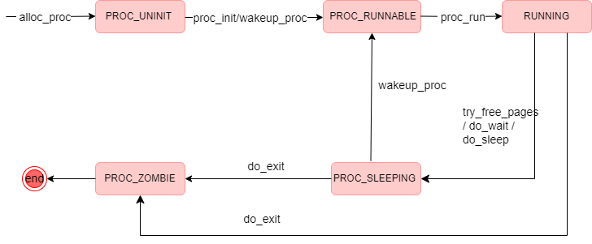

# 练习1：加载应用程序并执行（需要编码）

`do_execv`函数调用`load_icode`（位于kern/process/proc.c中）来加载并解析一个处于内存中的ELF执行文件格式的应用程序。你需要补充`load_icode`的第6步，建立相应的用户内存空间来放置应用程序的代码段、数据段等，且要设置好`proc_struct`结构中的成员变量`trapframe`中的内容，确保在执行此进程后，能够从应用程序设定的起始执行地址开始执行。需设置正确的`trapframe`内容。
* 请在实验报告中简要说明你的设计实现过程。</br>
>编写`load_icode`函数第六步，完成中断帧的设置：</br>
（1）设置`set tf->gpr.sp`，将`gpr.sp`指向用户栈顶，使得在用户程序运行时可以正确访问栈。</br>
（2）设置`tf->epc`，设置`epc`储存用户程序的入口点地址。</br>
（3）设置`tf->status`，存储处理器的状态信息。</br>
`SPP`用于表示处理器在发生异常或中断之前的特权级别。将`SSTATUS_SPP`状态位置0，表示退出当前中断后进入用户态。</br>
`SPIE`表示处理器在发生或中断之前的中断使能状态。将`SSTATUS_SPIE`状态位置 1，表示退出当前中断后开启中断。
```c
//(6) setup trapframe for user environment
    struct trapframe *tf = current->tf;
    // Keep sstatus
    uintptr_t sstatus = tf->status;
    memset(tf, 0, sizeof(struct trapframe));
    tf->gpr.sp = USTACKTOP;
    tf->epc = elf->e_entry;
    tf->status = (read_csr(sstatus) | SSTATUS_SPIE ) & ~SSTATUS_SPP;
```
* 请简要描述这个用户态进程被ucore选择占用CPU执行（RUNNING态）到具体执行应用程序第一条指令的整个经过。
>用户态进程被`ucore`选择占用CPU后，先将`satp`寄存器设置为用户态进程的页表基址，然后调用`switch_to`进行上下文切换，将当前寄存器状态保存到之前的`context`中，然后将要执行的进程的`context`中的寄存器状态恢复到寄存器中，使用`ret`指令跳转到`ra`寄存器指向的地址处继续执行。</br>
在`copy_thread`函数中已经将`ra`寄存器设置为了`forkret`函数的地址，所以会跳转到`forkret`函数中，转而执行`forkrets(tf)`，再执行`RESTORE_ALL`。因为在`load_icode`将`SSTATUS_SPP`设置为0，故不执行跳转，保存内核态栈指针，恢复`sstatus`和`sepc`以及通用寄存器，然后执行 sret 指令回到用户态，跳转到`sepc`指向的地址处，即`ELF`文件的入口地址，从而执行用户态程序。

# 练习2：父进程复制自己的内存空间给子进程（需要编码）

> 创建子进程的函数`do_fork`在执行中将拷贝当前进程（即父进程）的用户内存地址空间中的合法内容到新进程中（子进程），完成内存资源的复制。具体是通过`copy_range`函数（位于kern/mm/pmm.c中）实现的，请补充`copy_range`的实现，确保能够正确执行。

```c
int copy_range(pde_t *to, pde_t *from, uintptr_t start, uintptr_t end,
               bool share) {
    ...
            /* LAB5:EXERCISE2 YOUR CODE*/
             
            void * kva_src = page2kva(page);
            void * kva_dst = page2kva(npage);
            memcpy(kva_dst, kva_src, PGSIZE);
            ret = page_insert(to, npage, start, perm);
	...
}
```

- `void * kva_src = page2kva(page);`
  - `page2kva`：返回给定 `struct Page` 管理的内存的内核虚拟地址
  - 将源页面 `page` 的物理地址映射到内核的虚拟地址
- `void * kva_dst = page2kva(npage);`
  - 将目标页面 `npage` 的物理地址映射到内核的虚拟地址。得到目标页面在内核虚拟地址空间中的起始地址
- `memcpy(kva_dst, kva_src, PGSIZE);`
  - 将源页面的内容复制到目标页面
- `ret = page_insert(to, npage, start, perm);`
  - `page_insert`：建立一个物理页（`npage`）和一个虚拟地址之间映射
  - 建立目标地址空间 `to` 中目标页面 `npage` 与指定线性地址 `start` 之间的映射关系
  - `start` 是当前复制的线性地址，`perm` 是权限标志，包括用户/内核态、读/写/执行等

在 `copy_range` 函数中的主要步骤包括：

1. 通过 `get_pte` 函数找到进程 A 的某个虚拟地址对应的页表项，并检查是否有效。
2. 如果页表项有效，则为进程 B 分配一个新的物理页（`npage`）。
3. 使用 `page2kva` 函数获取源页和目标页的内核虚拟地址。
4. 使用 `memcpy` 函数将源页的内容复制到目标页中（大小为一个页面大小 `PGSIZE`）。
5. 最后使用 `page_insert` 函数建立进程 B 的线性地址 `start` 和新物理页 `npage` 之间的映射关系。

## 如何设计实现`Copy on Write`机制？给出概要设计，鼓励给出详细设计。

> Copy-on-write（简称COW）的基本概念是指如果有多个使用者对一个资源A（比如内存块）进行读操作，则每个使用者只需获得一个指向同一个资源A的指针，就可以该资源了。若某使用者需要对这个资源A进行写操作，系统会对该资源进行拷贝操作，从而使得该“写操作”使用者获得一个该资源A的“私有”拷贝—资源B，可对资源B进行写操作。该“写操作”使用者对资源B的改变对于其他的使用者而言是不可见的，因为其他使用者看到的还是资源A。

“Copy on Write” 机制的主要思想为使得进程执行 fork 系统调用进行复制的时候，父进程不会简单地将整个内存中的内容复制给子进程，而是暂时共享相同的物理内存页；而当其中—个进程需要对内存进行修改的时候，再额外创建—个自己私有的物理内存页，将共享的内容复制过去，然后在自己的内存页中进行修改

**具体设计：**

1. **页面管理**
   - 每个页面都增加一个计数器（`reference counter`），记录进程共享相同的物理页面的数量
   - 在页表项中，增加一个标志位，用于表示该页面是否是只读的
2. **写时复制**
   - 当一个进程试图写入一个只读页面时，操作系统会进行写时复制
   - 操作系统会检查`reference counter`，如果为1（只有一个进程），那么直接将页面标记为可写。如果大于1，进行页面复制
   - 新的页面分配物理内存，并将原始页面的内容复制到新页面，新页面的`reference counter`设为1，原始页面的`reference counter`减1（当减为0时就会释放物理内存）
3. **页表更新**
   - 更新原始页面的页表项，将其指向新的物理页面
   - 更新新页面的页表项，将其标记为可写

# 练习3： 阅读分析源代码，理解进程执行 fork/exec/wait/exit 的实现，以及系统调用的实现（不需要编码）

 请在实验报告中简要说明你对 fork/exec/wait/exit函数的分析。并回答如下问题：

1. 请分析fork/exec/wait/exit的执行流程
#### fork()函数
```c
fork()——>sys_fork()——> do_fork(0, stack, tf)
```
do_fork的作用：复制当前进程的上下文和资源到一个新的进程中。
- 首先检查当前总进程数目是否到达限制，如果到达限制，那么返回E_NO_FREE_PROC;
- 调用 alloc_proc 分配一个进程块;
- 调用setup_kstack为内核进程(线程)建立栈空间、分配内核栈;
- 调用copy_mm复制内存管理信息到新进程;
- 调用 copy_thread复制父进程的中断帧和上下文信息;
- 调用get_pid()为进程分配一个PID;
- 将进程控制块加入哈希表和链表，并实现相关进程的链接;
- 最后返回进程的PID
  

用户态与内核态分析：
- 用户态：父进程调用 fork()。
- 内核态:内核复制父进程的内存管理信息和线程信息，创建一个新的子进程。
- 用户态:子进程从fork调用返回，得到一个新的进程PID，父进程也从fork调用返回，得到子进程的PID。
#### exec()函数
```c
kernel_execve()——> ebreak——> syscall()——> sys_exec()——> do_execve()
```
do_execve()的作用：<br>

- 检查进程名称的地址和长度是否合法，如果合法，那么将名称暂时保存在函数栈中，否则返E_INVAL ;
- 如果当前进程的 mm 不为空，说明当前进程占用了内存，进行相关清理操作：将cr3页表基址指向内核页表，释放进程的内存映射、释放页目录表。
- 调用load_icode将代码加载进内存并建立新的内存映射关系，如果加载错误，那么调用panic报错;
- 调用set_proc_name重新设置进程名称。<br>

用户态与内核态分析：
- 用户态：进程调用 exec系统调用，加载并执行新的程序。
- 内核态：内核加载新程序的代码和数据，并进行一些必要的初始化。
- 用户态：新程序开始执行，原来的程序替换为新程序。
#### wait()函数
```c
wait() -> sys_wait() ->do_wait()
```
do_wait的作用：等待一个处于PROC_ZOMBIE状态的子进程,返回它的proc
- 首先进行内存检查，确保 code_store 指向的内存区域可访问。
- 遍历查找具有给定PID的子进程
  - 如果 pid 为零不为零，且该子进程的父进程是当前进程，将 haskid 标志设置为1。并且如果这个子进程处于PROC_ZOMBIE状态，跳转到found标签，表示找到PROC_ZOMBIE状态的子进程。
  - 如果 pid 为零，将循环遍历当前进程的所有子进程,将 haskid 标志设置为1,查找已经退出的子进程。
- 如果存在子进程(haskid==1)，将当前进程的状态设置为PROC_SLEEPING，表示等待子进程退出，然后调用调度器 schedule() 来选择新的可运行进程。
- 如果当前进程被标记为PF_EXITING，则调用do_exit以处理退出（为了防止死锁）,跳转到标签 repeat 继续执行。 
- 如果子进程是空闲进程 idleproc或初始化进程 initproc，则触发 panic。
- 存储子进程的退出状态，处理子进程退出并释放资源。

用户态与内核态分析：<br>
- 用户态:父进程调用 wait,等待子进程的退出。
- 内核态:如果子进程已经退出，内核返回子进程的退出状态给父进程;如果子进程尚未退出，父进程被阻塞，等待子进程退出。
- 用户态:父进程得到子进程的退出状态，可以进行相应的处理。

#### exit()函数
```c
exit()——>sys_exit()——>do_exit()
```
do_exit()函数作用：回收当前进程所占的大部分内存资源
- 检查当前进程是否为idleproc或initproc，如果是，发出panic
- 判断是否是用户进程(如果是,mm不为空)，则开始回收此用户进程所占用的用户态虚拟内存空间(切换到内核页表、释放进程的内存映射、释放页目录表、销毁进程的内存管理结构等)
- 设置进程状态为PROC_ZOMBIE，表示进程已退出，然后设置当前进程的退出码为error_code。表明此时这个进程已经无法再被调度了，只能等待父进程来完成最后的回收工作
- 如果当前父进程已经处于等待子进程的状态，就唤醒父进程，即父进程的wait_state被置为WT_CHILD，让父进程来帮子进程完成最后的资源回收工作。
- 如果当前进程还有子进程,则需要把这些子进程的父进程指针设置为内核线程init,且各个子进程指针需要插入到init的子进程链表中。
- 如果某个子进程的执行状态是PROC_ZOMBIE,则需要唤醒 init来完成对此子进程的最后回收工作。
- 执行schedule()调度函数，选择新的进程执行。

用户态与内核态分析：<br>
- 用户态:进程调用 exit系统调用，通知内核准备退出。
- 内核态:内核清理进程资源，包括释放内存、关闭文件等。
- 用户态:进程退出，返回到父进程。

2. 请给出ucore中一个用户态进程的执行状态生命周期图（包执行状态，执行状态之间的变换关系，以及产生变换的事件或函数调用）。（字符方式画即可）



3. 实验结果


# challenge 2

> 说明该用户程序是何时被预先加载到内存中的？与我们常用操作系统的加载有何区别，原因是什么？

- ucore：用户程序在编译时被链接到内核中，并定义好了起始位置和大小，然后在 `user_main()` 函数 `KERNEL_EXECVE` 宏调用 `kernel_execve()` 函数，从而调用 `load_icode()` 函数将用户程序加载到内存
- 常用的操作系统：用户程序通常是存储在外部存储设备上的独立文件，当需要执行某个程序时，操作系统会从磁盘等存储介质上动态地加载这个程序到内存中
- 原因： ucore 没实现硬盘


# 知识点
* 四个系统调用：
  * `sys_fork()`：把当前的进程复制一份，创建一个子进程，原先的进程是父进程。接下来两个进程都会收到`sys_fork()`的返回值，如果返回`0`说明当前位于子进程中，返回一个非`0`的值（子进程的`PID`）说明当前位于父进程中。然后就可以根据返回值的不同，在两个进程里进行不同的处理。
  * `sys_exec()`：在当前的进程下，停止原先正在运行的程序，开始执行一个新程序。`PID `变，但是内存空间要重新分配，执行的机器代码发生了改变。我们可以用`fork()`和`exec()`配合，在当前程序不停止的情况下，开始执行另一个程序。
  * `sys_exit()`：退出当前的进程。
  * `sys_wait()`：挂起当前的进程，等到特定条件满足的时候再继续执行。
* 用户环境定义：
  * 建立用户虚拟空间的页表和支持页换入换出机制的用户内存访存错误异常服务例程：提供地址隔离和超过物理空间大小的虚存空间。
  * 应用程序执行的用户态`CPU`特权级：在用户态`CPU`特权级，应用程序只能执行一般指令，如果特权指令，结果不是无效就是产生“执行非法指令”异常；
  * 系统调用机制：给用户进程提供“服务窗口”；
  * 中断响应机制：给用户进程设置“中断窗口”，这样产生中断后，当前执行的用户进程将被强制打断，`CPU`控制权将被操作系统的中断服务例程使用。