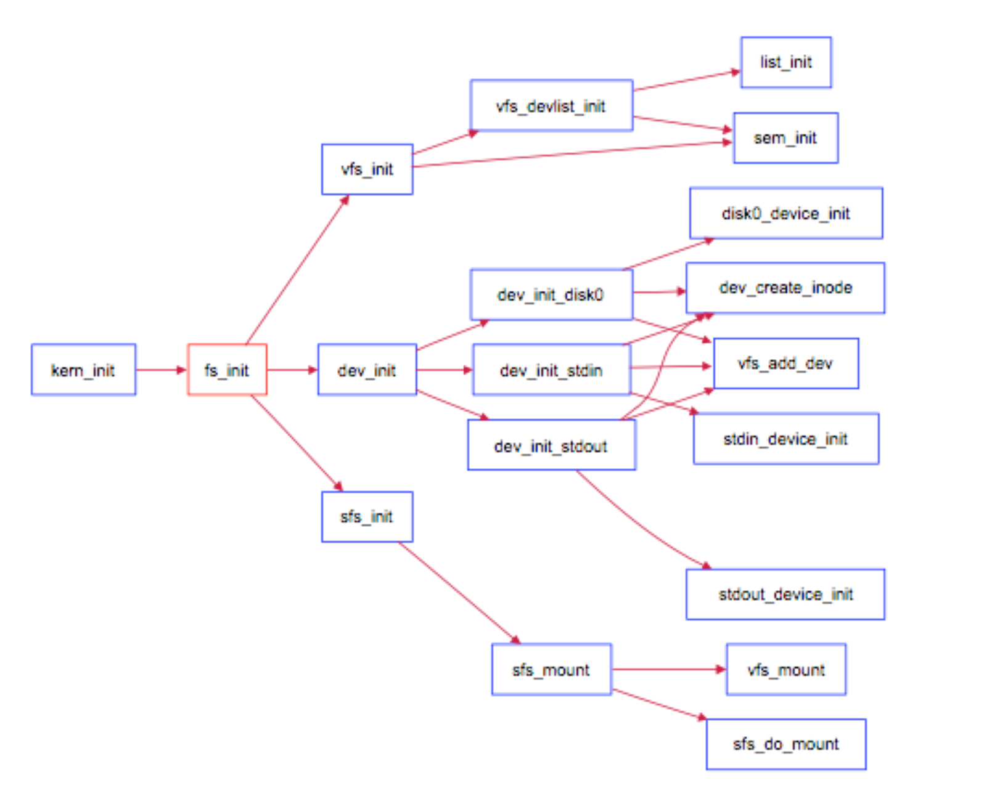
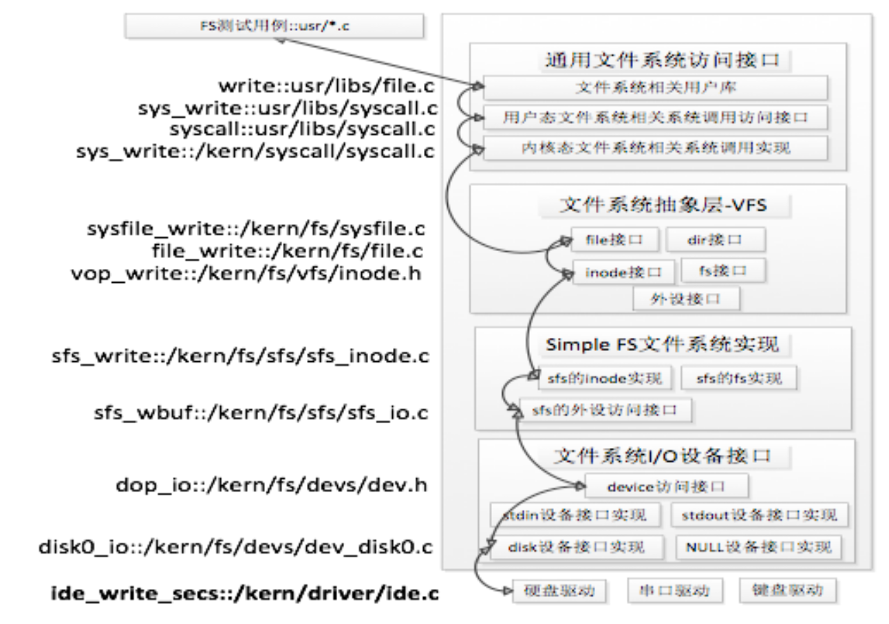

# 练习0：填写已有实验

本实验的代码合并要用到lab6的相关代码

```c
proc.c/alloc_proc()
{
    ...
         proc->rq = NULL;
        list_init(&(proc->run_link));
        proc->time_slice = 0;
        proc->lab6_run_pool.left = proc->lab6_run_pool.right = proc->lab6_run_pool.parent = NULL;
        proc->lab6_stride = 0;
        proc->lab6_priority = 0;
        
        proc->filesp = NULL;
}
```

```c
default_sched_stride.c/proc_stride_comp_f(void *a, void *b){
   	 struct proc_struct *p = le2proc(a, lab6_run_pool);
     struct proc_struct *q = le2proc(b, lab6_run_pool);
     int32_t c = p->lab6_stride - q->lab6_stride;
     if (c > 0) return 1;
     else if (c == 0) return 0;
     else return -1;
}

stride_init(struct run_queue *rq) {//开始初始化运行队列，并初始化当前的运行队，然后设置当前运行队列内进程数目为0
     list_init(&(rq->run_list));//初始化调度器类
     rq->lab6_run_pool = NULL;//对斜堆进行初始化，表示有限队列为空
     rq->proc_num = 0;//设置运行队列为空
}

stride_enqueue(struct run_queue *rq, struct proc_struct *proc) {//将进程 proc 添加到运行队列 rq 中。这个函数根据宏定义 USE_SKEW_HEAP 的状态，使用不同的方式将进程添加到运行队列中
#if USE_SKEW_HEAP
     rq->lab6_run_pool =
          skew_heap_insert(rq->lab6_run_pool, &(proc->lab6_run_pool), proc_stride_comp_f);//将进程 proc 插入到斜堆 rq->lab6_run_pool 中，按照给定的比较函数 proc_stride_comp_f 进行排序
#else//如果宏定义 USE_SKEW_HEAP 未被定义，表明使用链表作为调度算法的数据结构
     assert(list_empty(&(proc->run_link)));//确保进程的 run_link 指针为空，以确保进程不在其他运行队列中
     list_add_before(&(rq->run_list), &(proc->run_link));//将进程 proc 添加到运行队列 rq 的末尾
#endif
     if (proc->time_slice == 0 || proc->time_slice > rq->max_time_slice) {//检查进程的时间片（time slice）是否符合预期。
          proc->time_slice = rq->max_time_slice;//将该进程剩余时间置为时间片大小
     }
     proc->rq = rq;//将进程的 rq 指针指向当前运行队列 rq，表示该进程被加入到该运行队列中
     rq->proc_num ++;//增加运行队列 rq 中进程数量的计数器
}

stride_dequeue(struct run_queue *rq, struct proc_struct *proc) {//将进程 proc 从运行队列 rq 中移除
#if USE_SKEW_HEAP
     rq->lab6_run_pool =
          skew_heap_remove(rq->lab6_run_pool, &(proc->lab6_run_pool), proc_stride_comp_f);//删除斜堆中的指定进程
#else
     assert(!list_empty(&(proc->run_link)) && proc->rq == rq);
     list_del_init(&(proc->run_link));
#endif
     proc->rq = NULL;
     rq->proc_num --;//维护就绪队列中的进程总数
}

stride_pick_next(struct run_queue *rq) {//从运行队列 rq 中选择下一个要执行的进程,根据stride算法，只需要选择stride值最小的进程，即斜堆的根节点对应的进程即可
#if USE_SKEW_HEAP
     if (rq->lab6_run_pool == NULL) return NULL;
     struct proc_struct *p = le2proc(rq->lab6_run_pool, lab6_run_pool);//选择 stride 值最小的进程
#else
  	 list_entry_t *le = list_next(&(rq->run_list));

     if (le == &rq->run_list)
          return NULL;
     
     struct proc_struct *p = le2proc(le, run_link);
     le = list_next(le);
     while (le != &rq->run_list)
     {
          struct proc_struct *q = le2proc(le, run_link);
          if ((int32_t)(p->lab6_stride - q->lab6_stride) > 0)
               p = q;
          le = list_next(le);
     }
    
#endif
     if (p->lab6_priority == 0)//优先级为 0
          p->lab6_stride += BIG_STRIDE;//步长设置为最大值
     else p->lab6_stride += BIG_STRIDE / p->lab6_priority;//步长设置为优先级的倒数，更新该进程的 stride 值
     return p;
}

stride_proc_tick(struct run_queue *rq, struct proc_struct *proc) {//时钟中断
     if (proc->time_slice > 0) {//到达时间片
          proc->time_slice --;//执行进程的时间片 time_slice 减一
     }
     if (proc->time_slice == 0) {//时间片为 0
          proc->need_resched = 1;//设置此进程成员变量 need_resched 标识为 1，进程需要调度
     }
}
```

# 练习1: 完成读文件操作的实现（需要编码）

```c
sfs_io_nolock(struct sfs_fs *sfs, struct sfs_inode *sin, void *buf, off_t offset, size_t *alenp, bool write) {
    if ((blkoff = offset % SFS_BLKSIZE) != 0) {
        size = (nblks != 0) ? (SFS_BLKSIZE - blkoff) : (endpos - offset);
        if ((ret = sfs_bmap_load_nolock(sfs, sin, blkno, &ino)) != 0) {
            goto out;
        }
        if ((ret = sfs_buf_op(sfs, buf, size, ino, blkoff)) != 0) {
            goto out;
        }
        alen += size;
        if (nblks == 0) {
            goto out;
        }
        buf += size;
        blkno ++;
        nblks --;
    }

    size = SFS_BLKSIZE;
    
    while (nblks != 0) {
        if ((ret = sfs_bmap_load_nolock(sfs, sin, blkno, &ino)) != 0) {
            goto out;
        }
        if ((ret = sfs_block_op(sfs, buf, ino, 1)) != 0) {
            goto out;
        }
        alen += size; 
        buf += size; 
        blkno ++; 
        nblks --;
    }

    if ((size = endpos % SFS_BLKSIZE) != 0) {
        if ((ret = sfs_bmap_load_nolock(sfs, sin, blkno, &ino)) != 0) {
            goto out;
        }
        if ((ret = sfs_buf_op(sfs, buf, size, ino, 0)) != 0) {
            goto out;
        }
        alen += size;
    }
}
```

- **对齐处理**

  ```c
  if ((blkoff = offset % SFS_BLKSIZE) != 0) {//判断offset是否对其，bloff为块内偏移量
      size = (nblks != 0) ? (SFS_BLKSIZE - blkoff) : (endpos - offset);
      //size是需要读写的长度
      if ((ret = sfs_bmap_load_nolock(sfs, sin, blkno, &ino)) != 0) {//获取映射块
          goto out;
      }
      if ((ret = sfs_buf_op(sfs, buf, size, ino, blkoff)) != 0) {//读写对应块
          goto out;
      }
      alen += size;//更新，如果没有块就跳出
      if (nblks == 0) {
          goto out;
      }
      buf += size;
      blkno ++;
      nblks --;
  }
  ```

- **对齐块读写**

  ```c
  size = SFS_BLKSIZE;
      
  while (nblks != 0) {//处理对齐的块，循环读写每个块
      if ((ret = sfs_bmap_load_nolock(sfs, sin, blkno, &ino)) != 0) {
          goto out;
      }
      if ((ret = sfs_block_op(sfs, buf, ino, 1)) != 0) {
          goto out;
      }
      alen += size; //更新alen，移动缓冲区指针和块号，继续处理下一个块
      buf += size; 
      blkno ++; 
      nblks --;
  }
  ```

- **不对齐部分处理**

  ```c
  if ((size = endpos % SFS_BLKSIZE) != 0) {//文件末尾的不足一个块的部分
      if ((ret = sfs_bmap_load_nolock(sfs, sin, blkno, &ino)) != 0) {
          goto out;
      }
      if ((ret = sfs_buf_op(sfs, buf, size, ino, 0)) != 0) {
          goto out;
      }
      alen += size;
  }
  ```

# 练习2: 完成基于文件系统的执行程序机制的实现（需要编码）

# 扩展练习 Challenge1：完成基于“UNIX的PIPE机制”的设计方案

如果要在ucore里加入UNIX的管道（Pipe)机制，至少需要定义哪些数据结构和接口？（接口给出语义即可，不必具体实现。数据结构的设计应当给出一个(或多个）具体的C语言struct定义。在网络上查找相关的Linux资料和实现，请在实验报告中给出设计实现”UNIX的PIPE机制“的概要设方案，你的设计应当体现出对可能出现的同步互斥问题的处理。）

### 数据结构

管道机制：管道是由内核管理的一个缓冲区，相当于我们放入内存中的一个纸条。

- 管道的一端连接一个进程的输出。这个进程会向管道中放入信息。管道的另一端连接一个进程的输入，这个进程取出被放入管道的信息。
- 一个缓冲区不需要很大一般为4K大小，它被设计成为**环形的数据结构**，以便管道可以被循环利用。

- 当管道中没有信息的话，从管道中读取的进程会等待，直到另一端的进程放入信息。
- 当管道被放满信息的时候，尝试放入信息的进程会等待，直到另一端的进程取出信息。
- 当两个进程都终结的时候，管道也自动消失

在Linux中，管道的实现并没有使用专门的数据结构，而是借助了文件系统的file结构和VFS的索引节点inode。**通过将两个file结构指向同一个临时的 VFS 索引节点，而这个 VFS 索引节点又指向一个物理页面而实现的。**


### 接口与操作

- `pipe_read`：从管道中读取数据。

  - 检查管道，是否没有数据或内存被锁定。如果是且无阻塞，立即返回错误。
  - 使用互斥锁锁定管道 。复制物理内存中的字节而读出数据。解锁管道。
  - 如果没有成功读取到数据，当前进程就进入睡眠状态，直到有新的事件唤醒它。

- `pipe_write`：向管道中写入数据。

  - 检查 VFS 索引节点中的信息，如果内存不够或者内存被读程序锁定，且非阻塞，立即返回错误信息。
  - 锁定内存。将字节复制到 VFS 索引节点指向的物理内存而写入数据。写入之后，解锁内存，所有休眠在索引节点的读取进程会被唤醒。
  - 如果没有成功写入，写入进程就休眠在 VFS 索引节点的等待队列中，接下来，内核将调用调度程序，而调度程序会选择其他进程运行。

  ```c++
  //从管道中读取数据
  static ssize_t pipe_read(struct kiocb *iocb, struct iov_iter *to)
  {  
      //锁定管道——>复制物理内存中的字节而读出数据，数据保存在iocb中,字节数保存在ret中——>解锁管道
      //唤醒等待队列的进程
  	//如果没有数据或有人在write且非阻塞，立即返回错误信息
      
    
      //如果成功读取到数据 (ret > 0)，将读取等待队列 pipe->read_wait 添加到管道的等待队列 pipe->wait 中    
      //如果有人在write，将错误等待队列pipe->error_wait加入等待集合中。
      //如果没有成功读取到数据 (ret <= 0)，就调用 schedule() 函数让当前进程进入睡眠状态，直到有新的事件唤醒它。
    
      //从等待集合中移除pipe->error_wait和pipe->read_wait。
      
  }
  //向管道中写入数据。
  static ssize_t pipe_write(struct kiocb *iocb, struct iov_iter *from)
  {
    //锁定管道——>将字节复制到 VFS 索引节点指向的物理内存而写入数据——>解锁管道
    //唤醒等待队列的进程
    //如果管道的内存不够或者管道被read操作锁定且非阻塞，立即返回错误信息
  
    //如果成功写入数据 (ret > 0)，将读取等待队列 pipe->write_wait 添加到管道的等待队列 pipe->wait 中    
    //如果有人在reade，将错误等待队列pipe->error_wait加入等待集合中。
    //如果没有成功读取到数据 (ret <= 0)，就调用 schedule() 函数让当前进程进入睡眠状态，直到有新的事件唤醒它。
      
    //从等待集合中移除pipe->error_wait和pipe->read_wait。
      
  
  }
  ```

  

### 同步互斥问题处理

内核使用了**锁、等待队列和信号量**

读写操作都需要互斥锁保证读写操作的原子性。

等待队列保证了不满足条件的进程可以在等待队列里休眠，直到满足条件被唤醒后，再执行相关操作。

信号量用来进行等待和唤醒的操作，可以实现线程或进程之间的协调，确保它们以指定的顺序执行。


# 扩展练习 Challenge2：完成基于“UNIX的软连接和硬连接机制”的设计方案

> 如果要在 `ucore` 里加入 `UNIX` 的软连接和硬连接机制，至少需要定义哪些数据结构和接口？（接口给出语义即可，不必具体实现。数据结构的设计应当给出一个（或多个）具体的 `C`语言 `struct`定义。在网络上查找相关的 `Linux` 资料和实现，请在实验报告中给出设计实现 `UNIX`的软连接和硬连接机制 的概要设方案，你的设计应当体现出对可能出现的同步互斥问题的处理。

软连接和硬连接允许文件在文件系统中的多个位置共享相同的物理存储空间或者引用相同的文件。对于实现这两种链接机制，需要考虑以下设计方面：

### 1. Inode 结构的扩展：

在 UNIX 文件系统中，每个文件都有一个相应的 inode（索引节点），用于存储文件的元数据信息。为了支持链接机制，需要对 inode 结构进行扩展，以存储链接相关的信息。

### 2. 硬链接和软链接的区别：

- **硬链接**：
  - 硬链接是文件系统中同一个文件的多个名称。多个文件名都指向同一个 inode，并且在文件系统中没有区别对待它们。每个硬链接都有一个独立的目录项，删除一个硬链接并不会影响其他链接。
  - 在设计中，需要考虑对 inode 结构的扩展，以记录连接到该 inode 的硬链接数量。
- **软链接**：
  - 软链接是一个特殊的文件，它包含指向另一个文件或目录的路径名。软链接类似于快捷方式，在打开时被解析为实际文件或目录。
  - 在设计中，需要为软链接引入新的数据结构以存储软链接的目标路径信息。

### 扩展的 Inode 结构和链接结构：

- **Inode 扩展结构**（`inode_extension`）：
  - 包含链接计数器（`nlinks`），记录连接到该 inode 的硬链接数量。
  - 包含指向软链接结构的指针，用于存储软链接的目标路径信息。
- **软链接结构**（`symlink`）：
  - 包含一个字符数组来存储软链接的目标路径。

### 接口和操作：

- **创建链接**：
  - 创建硬链接：增加链接计数器，将新链接与现有 inode 关联。
  - 创建软链接：存储软链接信息，并创建一个指向目标路径的符号链接。
- **删除链接**：
  - 删除硬链接：减少链接计数器，如果计数器为零则释放 inode。
  - 删除软链接：从文件系统中删除软链接。
- **读取链接信息**：
  - 读取硬链接：获取链接计数器的值。
  - 读取软链接：读取软链接的目标路径。
- **修改链接计数器**：
  - 对连接计数器进行递增和递减操作需要确保同步访问，避免并发修改导致的问题。

### 同步与异常处理：

- **同步机制**：
  - 引入信号量、互斥锁等同步机制，确保对链接操作的原子性和线程安全性。
- **异常情况处理**：
  - 处理链接目标不存在、软链接路径无效或其他异常情况，以确保链接操作的可靠性和安全性。

### 数据结构

```c
#define MAX_PATH_LENGTH 256
#define MAX_INODE_EXTENSIONS 1000  // 假设最多有1000个扩展inode结构

// 软链接结构
struct symlink {
    char target_path[MAX_PATH_LENGTH];  // 软链接的目标路径
};

// 扩展的Inode结构
struct inode_extension {
    int nlinks;  // 被链接计数
    struct symlink *symlink;  // 指向软链接结构的指针
};

// Inode结构
struct inode {
    // 其他 inode 相关信息...
    
    // 连接计数器，用于记录硬链接数
    int link_count;

    // 指向扩展信息的指针
    struct inode_extension *extension;

    // 锁，用于同步访问和修改 inode 结构
    struct semaphore inode_lock;
    
    // 其他属性...
};
```

### 接口代码

```c
//创建硬链接
int create_hard_link(const char* existing_path, const char* new_link_path) {
    // 通过 existing_path 找到相应的 inode
    
    // 分配一个新的目录项，指向相同的 inode
    
    // 增加链接计数器
    
    return 0; // 返回成功或失败的状态码
}

//创建软连接
int create_soft_link(const char* target_path, const char* link_path) {
    // 创建一个新的 inode
    
    // 分配一个新的目录项，指向新的 inode
    
    // 存储软链接信息到 inode 的扩展结构中
    
    return 0; // 返回成功或失败的状态码
}

//删除链接
int unlink(const char* path) {
    // 通过 path 找到相应的 inode
    
    // 如果是硬链接，则减少链接计数器
    // 如果是软链接，则释放相关资源
    
    // 删除对应的目录项
    
    return 0; // 返回成功或失败的状态码
}

//读取链接的目标路径
ssize_t readlink(const char* path, char* buf, size_t bufsize) {
    // 通过 path 找到相应的 inode
    
    // 如果是软链接，读取目标路径信息到 buf 中
    
    return 0; // 返回读取的字节数或错误码
}

```


## 知识点

### 文件系统的初始化流程

kern\init\init.c中的kern_init函数，增加了对fs_init函数的调用。fs_init函数就是文件系统初始化的总控函数。它的调用函数如下图所示。



下面对上面这些函数做一些解释

首先要知道，信号量结构体semaphore_t，包括：

- 信号量value。它的作用是控制访问的次序以及允许访问的数量。通常将 value 初始化为资源可用的数量， 每次线程或进程访问该资源时将 value 减一，离开该资源时将 value 加一。  当 value 为 0 时，其他线程或进程需要等待进程离开资源后才能访问。
- 等待该信号量的线程链表wait_queue。

接着可以看到kern_init调用了下面三个函数，这三个初始化函数联合在一起，协同完成了整个虚拟文件系统、SFS文件系统和文件系统对应的设备（键盘、串口、磁盘）的初始化工作。

- 虚拟文件系统初始化函数vfs_init：建立了一个device list双向链表vdev_list，为后续具体设备（键盘、串口、磁盘）以文件的形式呈现建立查找访问通道。

  - 用sem_init()：初始化信号量bootfs_sem，它的信号量为1，表示只能允许一个线程或进程使用，并且它的等待链表为空。
  - 用vfs_devlist_init()：
    - 初始化一个空的双向链表vdev_list
    - 初始化信号量vdev_list_sem，信号量为1

- 与文件相关的设备初始化函数dev_init：

  - 经过一些函数的嵌套调用，最后由disk0/stdin/stdout_device_init完成对具体设备的初始化，把它们抽象成一个设备文件，并建立对应的inode数据结构，最后把它们链入到vdev_list中。

- Simple FS文件系统的初始化函数sfs_init

  - 完成对Simple FS的初始化工作，经过一些函数的嵌套调用，最后由vfs_mount函数（实际调用mountfunc函数）和sfs_do_mount函数把此实例文件系统挂在虚拟文件系统中，从而让ucore的其他部分能够通过访问虚拟文件系统的接口来进一步访问到SFS实例文件系统。

  

### ucore的文件系统构架组成



- 通用文件系统访问接口层：这一层访问接口让应用程序能够通过一个简单的接口获得 ucore 内核的文件系统服务。
- 文件系统抽象层：
  - 作用：向上提供一个一致的接口给内核其他部分（文件系统相关的系统调用实现模块和其他内核功能模块）访问。向下把不同文件系统的对外共性接口提取出来，放进同样的抽象函数指针列表中，这样屏蔽了不同文件系统的实现细节。
  - 构成：
    - file接口：用结构体file表示，保存进程在内核中直接访问的文件相关信息（文件的当前状态、可读可写、访问文件的当前位置、该文件对应的内存inode指针等）。
    - dir接口：用结构体files_struct表示，保存进程访问文件的数据（进程访问文件的数据、进程打开文件的数组、一个信号量以确保fs_struct的互斥访问）
      - 当创建一个进程后，该进程的 files_struct 将会被初始化或复制父进程的 files_struct。
      - 当用户进程打开一个文件时，将从 fd_array 数组中取得一个空闲 file 项，然后会把此 file 的inode指针设置为此文件的 inode 的起始地址。
    - inode接口：用结构体inode表示，保存不同文件系统的特定索引节点信息，以避免进程直接访问具体文件系统。这个结构体包含了：
      - 设备文件系统与SFS文件系统的内存inode信息
      - 此inode所属文件系统类型
      - 此inode的引用计数
      - 打开此inode对应文件的个数
      - 抽象的文件系统指针
      - 抽象的inode函数in_ops，可以说对常规文件、目录、设备文件所有操作都可以通过这个抽象函数实现。用户只需要调用这个函数，就能执行前面的所有操作，而不需要知道每种访问操作的具体实现。
      - ps:每个 `inode`也占用一个 block
- Simple FS 文件系统层：一个基于索引方式的简单文件系统实例。向上通过各种具体函数实现以对应文件系统抽象层提出的抽象函数。向下访问外设接口
  - 这里该文件系统以block （4K，与内存 page 大小相等）为基本单位。
  - sfs的布局如下：
  - <./3.png" alt="image-20231223004524368" style="zoom: 33%;" />
    - 第0个块为超级块，用结构体sfs_super表示，保存文件系统的所有关键参数，当计算机被启动或文件系统被首次接触时，超级块的内容就会被装入内存。（魔数、已使用和未使用的块数等）这里的魔数其实是特定文件格式的内存特征，以判断磁盘镜像是否是合法的 SFS img。
    - 第1个块为根目录索引节点
    - 第2个块为空闲块映射，它的每一个比特位表示对应的块是否空闲。
    - 磁盘索引节点，用sfs_disk_inode表示，用一级或者二级索引，记录文件内容的存储位置。保存在硬盘中，在进程需要时才被读入到内存中。
    - 内存索引节点，用sfs_inode表示，包含了磁盘索引节点的信息，在打开一个文件后才创建的，如果关机则相关信息都会消失。
      - sfs_bmap_load_nolock ()： 根据目录的inode和inode中的逻辑块索引，找到磁盘块的编号。
      - sfs_bmap_truncate_nolock ()：释放文件末尾的磁盘块。当一个文件或目录被删除时，sfs 会循环调用该函数直到释放所有的数据页。
      - sfs_dirent_read_nolock ()：从包含该文件项的磁盘块中读取该文件项
      - sfs_dirent_search_nolock()：搜索指定文件名的文件项，返回该文件项的索引和文件的磁盘块号。
- 外设接口层：向上提供 device 访问接口屏蔽不同硬件细节。向下实现访问各种具体设备驱动的接口，比如 disk 设备接口/串口设备接口/键盘设备接口等。


