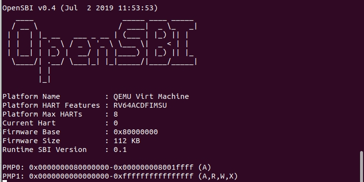
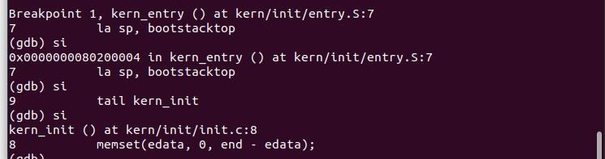
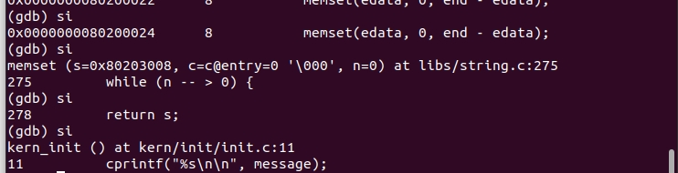
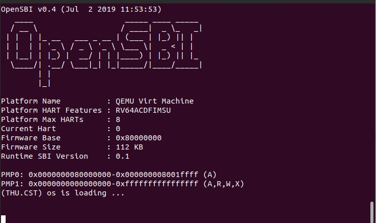
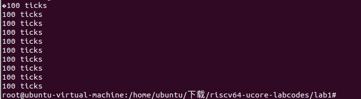
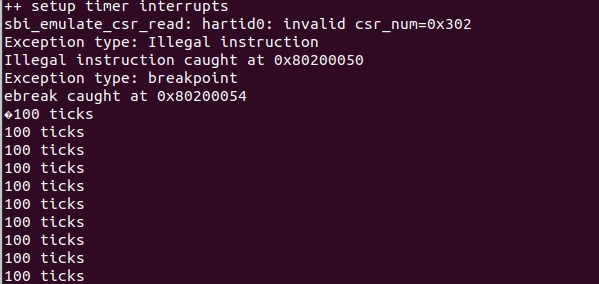

# lab 0.5

## 练习1：使用GDB验证启动流程

​	**实验内容：**使用gdb调试QEMU模拟的`RISC-V`计算机加电开始运行到执行应用程序的第一条指令（即跳转到0x80200000）这个阶段的执行过程

### Q1：RISC-V硬件加电后的几条指令在哪里？

执行指令：

```assembly
x/10i $pc
```

输出：

```assembly
   0x1000:	auipc	t0,0x0          ;将0x0拓展为32位立即数加到pc上，并赋值给t0，执行后t0=0x0000000000001000
   0x1004:	addi	a1,t0,32        ;
   0x1008:	csrr	a0,mhartid      ;将mhartid（Hart ID寄存器的内容）的值加载到寄存器a0中。mhartid通常用于多核处理器中，以标识当前核的ID
   0x100c:	ld	t0,24(t0)           ;从地址(t0+24)处加载一个双字（64位）的数据，并将其存储在寄存器t0中。所读取的地址是0x1018,得到的数据为0x80000000，随后拓展为0x0000000080000000
   0x1010:	jr	t0                  ;跳转到0x80000000，bootloader的加载位置
   0x1014:	unimp                   ;空指令
   0x1016:	unimp
   0x1018:	unimp
   0x101a:	0x8000
   0x101c:	unimp
```

### Q2：完成了哪些功能？

1. **复位、加载`OpenSBI`**：加电后，RISC-V复位到地址0x1000处，加载模拟`bootloader`的`OpenSBI.bin`到物理地址0x80000000，通过上述指令将`pc`跳转到0x80000000处，**如Q1分析**

2. **执行OpenSBI、加载操作系统内核：**执行`OpenSBI`时，会完成一些硬件的设置，并且将os.bin加载到0x80200000处

   在0x80200000处打断点后continue：

   ```assembly
   b *0x80200000
   
   Breakpoint 1 at 0x80200000: file kern/init/entry.S, line 7.
   ```

   `qemu`输出如图所示：

   

3. **执行操作系统内核（内存初始化）：**控制权从`OpenSBI`传递给操作系统内核的入口点

   ​		当控制权交给`OS`之后，会对`OS`进行初始化，在进行debug后发现，调用了`entry.S`中的`kern_entry()`似乎是内核的入口。但通过进一步执行，发现控制权转移到`kern_init`，`kern_init`可能才是内核真正的入口

   

   ​		继续debug发现，程序执行了`kern_init()`函数的具体内容

   

   - `memset(edata, 0, end - edata);` 

     ​		表示从内存地址 `edata` 开始，连续设置一块内存，大小为 `end - edata`的字节，将其所有字节的值设置为0。

     ​		通常用于清零或初始化内存区域，以确保内存中的数据不包含任何旧值或垃圾数据。这在编程中经常用于初始化数据结构、清空缓冲区或进行内存管理

   - `cprintf()`调用重构的函数，输出指定内容

   - 执行死循环

   

## 本实验重要知识点
*  `bootloader`：负责 boot(开机)，还负责 load(将操作系统加载 OS 到内存里)。
* RISCV 有四种特权级:
<br/> (1) `U-mode` ：用户程序、应用程序的特权级
<br/> (2) `S-mode `：操作系统内核的特权级
<br/> (3) `M-mode `：固件的特权级eg.OpenSBI
<br/> (4) `Reserved`(目前未使用，保留)
* 程序的功能段 
<br/> (1) `.text` 段，即代码段，存放汇编代码；
<br/> (2) `.rodata `段，即只读数据段，存放只读数据，通常是程序中的常量；
<br/> (3) `.data` 段，存放被初始化的可读写数据，通常保存程序中的全局变量；
<br/>(4) `.bss` 段，存放被初始化为 00 的可读写数据，与.data 段的不同之处在于我们知道它要被初始化为 00 ，因此在可执行文件中只需记录这个段的大小以及所在位置即可，而不用记录里面的数据。
<br/>(5) `stack `，即栈，用来存储程序运行过程中的局部变量，以及负责函数调用时的各种机制。它从高地址向低地址增长；
<br/>(6) `heap` ，即堆，用来支持程序运行过程中内存的动态分配。
* `makefile`：`make` 命令执行时，需要一个 makefile（或 Makefile）文件，以告诉 make 命令需要怎么样的去编译和链接程序。

## 重要的OS原理

* 中断处理：中断是操作系统处理外部事件的机制，包括硬件中断和软件中断。通过在GDB中设置中断断点，可以观察中断的触发和处理过程，查看中断处理函数的执行情况。

* 进程和线程创建：进程和线程的创建是操作系统中的重要操作，通过在GDB中设置断点，可以观察进程和线程创建的过程，查看进程和线程的上下文切换情况。

* 内存管理：内存管理是操作系统负责管理和分配内存资源的机制，包括内存分页和分段等。通过在GDB中查看内存映射和内存分配情况，可以验证内存管理的正确性。


# lab 1

## 练习1：理解内核启动中的程序入口操作

阅读 kern/init/entry.S内容代码，结合操作系统内核启动流程

### Q1：指令 la sp, bootstacktop 完成了什么操作，目的是什么？

 指令 `la sp, bootstacktop` 完成了将 `bootstacktop` 的地址加载到 `sp` 寄存器中的操作， `sp` 现在包含了内核栈的顶部地址。
<br/>这个指令的目的是设置内核栈的顶部地址，即将栈指针初始化为内核栈的起始地址。
通过设置栈指针，操作系统可以在内核代码执行过程中，使用栈来保存和恢复函数调用的上下文信息，以及处理中断和异常时的状态。

### Q2：tail kern_init 完成了什么操作，目的是什么？

指令`tail kern_init` 用于跳转到 `kern_init` 函数的入口点，并且将当前的栈指针作为参数传递给 `kern_init` 函数，保持调用栈的一致性。
<br/>这个指令的目的是跳转到内核的初始化函数，并开始执行操作系统的初始化过程。`kern_init` 函数是内核初始化的入口点，它负责进行系统的初始化工作，如初始化硬件设备、建立内存管理、创建进程和线程等。通过调用 `kern_init` 函数，操作系统可以完成必要的准备工作，并开始运行用户程序。


## 练习2：完善中断处理 （需要编程）

`set_sbi_timer()`通过OpenSBI的时钟事件触发一个中断，跳转到`trapentry.S`的 `__alltraps` 标记，汇编宏`SAVE ALL`保存当前上下文，以待后续的恢复。 跳转到`trap.c`的`trap`函数中，进行中断处理。 

**补充后的代码：**

```c
case IRQ_S_TIMER:
	    clock_set_next_event(); // 设置时钟中断
            num++; // 计数器加一
            if (num == 100) { // 当计数器加到100时
                print_ticks(); // 调用打印函数
                num = 0; // 重置计数器
		num_ticks++;
                if (num_ticks == 10) { // 当打印次数为10时
                    sbi_shutdown(); // 调用关机函数
                }
            }
            break;
```

**测试结果为：**



- trap()函数的参数是一个叫trapframe结构体。trapframe包括32个通用寄存器和4个控制状态寄存器的值，即trap的参数是切换前上下文。
- trap()借助trap_dispatch()按照中断类型进行分发到interrupt_handler()或exception_handler()。
- interrupt 指外部中断，典型的有定时器倒计时结束、串口收到数据等。执行时钟中断对应的处理语句，累加计数器，同时设置下一次时钟中断。  
- exception 指异常中断，典型的有访问无效内存地址、执行非法指令 (除零)、发生缺页等。他们有的可以恢复 (如缺页)，有的不可恢复 (如除零)，只能终止程序执行。输出指令异常类型，epc即sepc保存了异常中断指令的下一条地址
- 完成处理，返回到trapentry.S。  恢复原先的上下文，中断处理结束。

## Challenge1：描述与理解中断流程

**处理中断异常流程：**

1. 异常的产生：在`init.c`中调用`idt_init()`初始化中断描述符表（IDT）->调用`clock_init()`初始化系统的时钟中断，并嵌套调用`set_csr()`打开时钟中断使能，调用`sbi_set_time()`使`time=timebase`时发生中断
2. 中断产生后，CPU跳到stvec（中断向量表基址），此处只有一个中断处理程序，直接指向该中断处理程序的地址
3. 初始化stvec寄存器，进入中断入口，保存上下文（寄存器的状态）
4. 进入中断处理程序`trap.c`,，`interrupt_handler()`和`exception_handler()`根据`scause`的数值进行分类并处理
5. 中断处理程序结束后恢复现场，执行后续代码

**`mov a0, sp` 的目的**：将栈指针 `SP` 的值保存到寄存器 `a0` 中，将 `SP` 的值传递给异常处理函数，使其可以访问内核栈上的保存的寄存器状态。

**SAVE_ALL中寄寄存器保存在栈中的位置**是由`trapentry.c`中宏定义`SAVE_ALL`中相对sp的偏移量决定的

**对于任何中断，`__alltraps` 中都需要保存所有寄存器**。在`ucore`中只存在一个中断处理程序，因此，在进入程序时，需要保证所需上下文信息都存在。并且，当中断处理结束，理想状态下应该恢复处理前的所有状态，需要所有寄存器的信息。但在恢复阶段，对于控制状态寄存器的四个寄存器`status`,`epc`,`badaddr`,`cause`只恢复了其中的`status`和`epc`寄存器。

## Challenge2：理解上下文切换机制

1. `csrw sscratch, sp；csrrw s0, sscratch, x0`将`sp`的值赋给`sscratch`，将`sscratch` 的当前值读取到寄存器 `s0` 中，并将 `sscratch` 寄存器的值设置为0。因为RISCV不能直接从CSR写到内存，需要csrr把CSR读取到通用寄存器，再从通用寄存器写到内存。这种操作通常用于保存栈指针的值以便于后续恢复，保存 CSR 寄存器的当前状态.

2. `save all`里面保存了`stval scause`这些csr，而在`restore all`里面却不还原它们，最后只恢复了sstatus，sepc两个。因为sstatus决定了是否禁用中断，sepc保存了发生异常的下一条指令的地址，这两个CSR影响了后续程序的正常执行。而其他的CSR存储的是有关中断处理的信息，例如中断类型，中断发生的原因等一些辅助信息，仅供中断处理使用，与程序的正常执行没有关系。

   

## Challenge3：完善异常中断

- ### 触发非法指令异常

  - 在`lab1/kern/init/init.c`中插入非法指令代码

    ```assembly
    asm volatile (
            "mret\n"  // 非法指令，将触发非法指令异常
        );
    ```

  - 在`lab1/kern/trap/trap.c`中插入对应的异常处理函数，输出错误类型和错误位置

    ```assembly
    case CAUSE_ILLEGAL_INSTRUCTION:
                 // 非法指令异常处理
                 /* LAB1 CHALLENGE3   YOUR CODE : 2111954 */
                cprintf("Exception type: Illegal instruction\n");//输出指令异常类型
    	    	cprintf("Illegal instruction caught at 0x%08x\n", tf->epc); //输出异常指令地址
                tf->epc += 4;// 更新 epc 寄存器以继续执行下一条指令
                break;
    ```

    

- ### 触发断点异常

  - 在`lab1/kern/init/init.c`中插入断定异常代码

    `    asm volatile ("ebreak");`

  - 在`lab1/kern/trap/trap.c`中插入对应的异常处理函数，输出错误类型和错误位置
  
    ```assembly
    case CAUSE_BREAKPOINT:
                //断点异常处理
                /* LAB1 CHALLLENGE3   YOUR CODE : 2111954 */
                /*(1)输出指令异常类型（ breakpoint）
                 *(2)输出异常指令地址
                 *(3)更新 tf->epc寄存器
                */
                cprintf("Exception type: breakpoint\n"); //输出指令异常类型
    		    cprintf("ebreak caught at 0x%08x\n", tf->epc);	//输出异常指令地址
                tf->epc += 4;  // 更新 epc 寄存器以继续执行下一条指令
                break;
    ```
  
    **测试结果为：**
    
    

## 重要知识点

* ### riscv64 权限模式
  * S模式（监管者模式）：核心是支持基于页面的虚拟内存机制。Unix 系统中的大多数例外都应该进行 S 模式下的系统调用。M 模式的异常处理程序可以将异常重新导向 S 模式，也支持通过异常委托机制选择性地将中断
和同步异常直接交给 S 模式处理, 而完全绕过 M 模式
  * ●	M 模式机器模式：M 模式 是 RISC-V 中 hart可以执行的最高权限模式。在 M 模式下运行的 hart 对内存,I/O 和一些对于启动和配置系统来说必要的底层功能有着完全的使用权。默认情况下, 发生所有异常 (不论在什么权限模式下) 的时候, 控制权都会被移交到 M 模式的异常处理程序。它是唯一所有标准 RISC-V 处理器都必须实现的权限模式。
  
* ### 中断分类
  * 异常 (Exception)：指在执行一条指令的过程中发生了错误，此时我们通过中断来处理错误。最常见的异常包括：访问无效内存地址、执行非法指令 (除零)、发生缺页等。他们有的可以恢复 (如缺页)，有的不可恢复 (如除零)，只能终止程序执行。
  *	陷入 (Trap)：指我们主动通过一条指令停下来，并跳转到处理函数。常见的形式有通过 ecall 进行系统调用(syscall)，或通过 ebreak 进入断点 (breakpoint)。
  * 外部中断 (Interrupt)：简称中断，指的是 CPU 的执行过程被外设发来的信号打断，此时我们必须先停下来对该外设进行处理。典型的有定时器倒计时结束、串口收到数据等。
  *	由于中断处理需要进行较高权限的操作，中断处理程序一般处于内核态，或者说，处于“比被打断的程序更高的特权级”。在 RISCV 里，中断 (interrupt) 和异常 (exception) 统称为“trap”。


* ### 执行流
  * 内核初始化函数 `kern_init()` 的执行流：(从 `kern/init/entry.S` 进入) -> 输出一些信息说明正在初 始化 -> 设置中断向量表 （stvec）跳转到的地方为 `kern/trap/trapentry.S` 里的一个标记 -> 在 `kern/ driver/clock.c` 设置第一个时钟事件，使能时钟中断-> 设置全局的 S mode 中断使能位-> 现在开始不断 地触发时钟中断 

  * 产生一次时钟中断的执行流：`set_sbi_timer()` 通过 OpenSBI 的时钟事件触发一个中断，跳转到` kern/trap/ trapentry.S` 的 __alltraps 标记 -> 保存当前执行流的上下文，并通过函数调用，切换为 `kern/trap/ trap.c` 的中断处理函数 `trap()` 的上下文，进入 `trap()` 的执行流。切换前的上下文作为一个结构体， 传递给 trap() 作为函数参数 -> `kern/trap/trap.c` 按照中断类型进行分发 ( `trap_dispatch()`, `interrupt_handler()`)-> 执行时钟中断对应的处理语句，累加计数器，设置下一次时钟中断-> 完成处理， 返回到 `kern/trap/trapentry.S`-> 恢复原先的上下文，中断处理结束。


* ### stvec

  stvec，即所谓的“中断向量表基址”。中断向量表的作用就是把不同种类的中断映射到对应的中断处理程序。
  - 如果只有一个中断处理程序，那么可以让stvec 直接指向那个中断处理程序的地址
  - 对于 RISCV 架构，stvec 会把最低位的两个二进制位用来编码一个“模式”：
  - 若是“00”就说明更高的其余二进制位存储的是唯一的中断处理程序的地址
  - 若是“01”说明更高的 其余二进制位存储的是中断向量表基址，通过不同的异常原因来索引中断向量表。

* ## 控制状态寄存器
  S态下发生中断，以下寄存器会被硬件自动设置，将一些信息提供给中断处理程序：
  *  sepc：它会记录触发中断的那条指令的地址；
  * scause：它会记录中断发生的原因，还会记录该中断是不是一个外部中断；
  * stval，它会记录一些中断处理所需要的辅助信息，比如指令获取 (instruction fetch)、访存、缺页异常，它会把发生问题的目标地址或者出错的指令记录下来，这样我们在中断处理程序中就知道处理目标了。
  
* ### 特权指令
  * ecall：当我们在 S 态执行这条指令时，会触发一个 `ecall-from-s-mode-exception`，从而进入 M 模式中的中断处理流程（如设置定时器等）；当我们在 U 态执行这条指令时，会触发一个 `ecall-from-u-mode-exception`，从而进入 S 模式中的中断处理流程（常用来进行系统调用）。
  * sret：用于 S 态中断返回到 U 态，实际作用为 `pc←sepc`，回顾 sepc 定义，返回到通过中断进入 S 态之前的地址。 
  * ebreak(environment break)：执行这条指令会触发一个断点中断从而进入中断处理流程。 
  * mret：用于 M 态中断返回到 S 态或 U 态，实际作用为 `pc←mepc`，回顾 sepc 定义，返回到通过中断进入 M 态 之前的地址。


